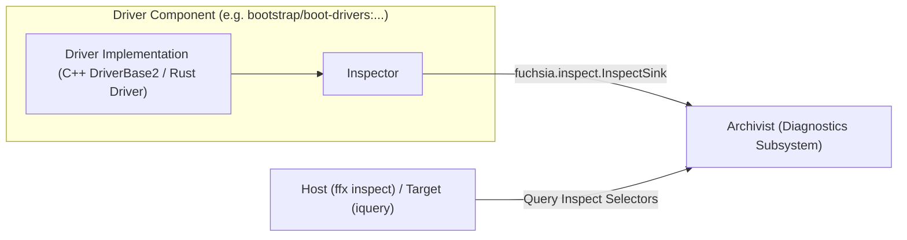

# Using Inspect in drivers

This guide explains how to instrument Fuchsia Driver Framework (DFv2) drivers
with [Inspect][inspect_overview] and how to query Inspect data from driver
components.

## Overview

In Fuchsia's Driver Framework (DFv2), **drivers are components**. Drivers participate
directly in Fuchsia's component diagnostics architecture and publish Inspect data
using the standard `fuchsia.inspect.InspectSink` capability, just like any other
Fuchsia component.



Key characteristics of Inspect in DFv2:

- **Standard capability routing**: The driver component manifest requests
  `fuchsia.inspect.InspectSink` using the standard `inspect/client.shard.cml` shard.
- **Component-attributed Inspect**: Inspect hierarchies are attributed to each
  individual driver component under its component moniker (e.g. under
  `bootstrap/boot-drivers` or `bootstrap/base-drivers`).
- **Standard tooling**: Driver Inspect data is inspected using `ffx inspect` or
  `iquery` with standard component selectors or component URL matching.

## Prerequisites

If you are unfamiliar with Inspect basics, review the following guides:

- [Inspect overview][inspect_overview]
- [Inspect codelab][inspect_codelab]
- [Inspect selectors][selectors]

## Include Inspect in a driver

### 1. Update the component manifest (`.cml`)

Include the Inspect client shard in your driver's `.cml` file:

```json5
{
    include: [
        "inspect/client.shard.cml",
        "syslog/client.shard.cml",
    ],
    program: {
        runner: "driver",
        binary: "driver/my_driver.so",
        bind: "meta/bind/my_driver.bindbc",
    },
}
```

The `inspect/client.shard.cml` shard routes the `fuchsia.inspect.InspectSink` protocol
from the parent diagnostics directory into the driver's incoming namespace.

### 2. Add build dependencies

* {C++}

  Add `//sdk/lib/inspect/component/cpp` to your driver's `BUILD.gn`:

  ```gn
  fuchsia_cc_driver("my_driver") {
    deps = [
      "//sdk/lib/driver/component/cpp",
      "//sdk/lib/inspect/component/cpp",
    ]
  }
  ```

  If building with Bazel, add `@fuchsia_sdk//pkg/inspect_component_cpp` in `BUILD.bazel`:

  ```bazel
  fuchsia_cc_driver(
      name = "my_driver",
      deps = [
          "@fuchsia_sdk//pkg/driver_component_cpp",
          "@fuchsia_sdk//pkg/inspect_component_cpp",
      ],
  )
  ```

* {Rust}

  In your driver's `BUILD.gn`, depend on `//sdk/lib/driver/component/rust`, `//src/lib/diagnostics/inspect/rust`, and `//src/lib/fuchsia-async`:

  ```gn
  fuchsia_rust_driver("my_driver") {
    deps = [
      "//sdk/lib/driver/component/rust",
      "//src/lib/diagnostics/inspect/rust",
      "//src/lib/fuchsia-async",
    ]
  }
  ```

### 3. Initialize and publish Inspect

* {C++}

  In C++, drivers inheriting from [`fdf::DriverBase2`][write-a-minimal-dfv2-driver]
  can publish an Inspect tree using `context.CreateInspector(this)`:

  ```cpp
  #include <lib/driver/component/cpp/driver_base2.h>
  #include <lib/driver/component/cpp/driver_export2.h>
  #include <lib/inspect/component/cpp/component.h>

  class MyDriver : public fdf::DriverBase2 {
   public:
    MyDriver() : fdf::DriverBase2("my_driver") {}

    zx::result<> Start(fdf::DriverContext context) override {
      // 1. Create and publish the ComponentInspector.
      // Must be called before context.take_incoming() if transferring ownership.
      component_inspector_ = context.CreateInspector(this);

      // 2. Build the Inspect hierarchy from the root node.
      hardware_node_ = component_inspector_->root().CreateChild("hardware_status");
      revision_prop_ = hardware_node_.CreateUint("revision_id", 0x10);
      requests_count_ = hardware_node_.CreateUint("requests_count", 0);

      // 3. For values that do not change, use Record* helpers to avoid storing handles:
      hardware_node_.RecordString("serial_number", "ABC-1234");

      // 4. (Optional) Report component health:
      component_inspector_->Health().Ok();

      return zx::ok();
    }

    void HandleDeviceRequest() {
      requests_count_.Add(1);
    }

    // Accessor for unit tests:
    const inspect::Inspector& inspector() const {
      return component_inspector_->inspector();
    }

   private:
    std::optional<inspect::ComponentInspector> component_inspector_;
    inspect::Node hardware_node_;
    inspect::UintProperty revision_prop_;
    inspect::UintProperty requests_count_;
  };

  FUCHSIA_DRIVER_EXPORT2(MyDriver);
  ```

  **Key points:**

  - **`context.CreateInspector(this)`**: Automatically connects to `fuchsia.inspect.InspectSink`
    in the incoming namespace and publishes the Inspect tree with the tree name set to the driver's
    `name()`. Invoke `context.CreateInspector(this)` *before* taking the namespace via
    `context.take_incoming()`.
  - **Node & Property Lifetimes (RAII)**: Inspect properties are RAII objects. If a property
    will change over time (such as `requests_count_`), store the property object as a class
    member or store it in an `inspect::ValueList`. If you do not keep the property alive, it is
    removed from the Inspect VMO. For immutable values, use `Record*` helper methods
    (e.g., `RecordString`, `RecordUint`), which commit the value directly into the VMO without
    requiring an object handle.
  - **Component Health**: Use `component_inspector_->Health().Ok()`, `.Starting()`, or
    `.Unhealthy(reason)` to report standard [component health][health-metrics].

* {Rust}

  In Rust drivers implementing `fdf_component::Driver`:

  ```rust
  use fdf_component::{Driver, DriverContext, DriverError};
  use fuchsia_async::Scope;
  use fuchsia_inspect::{Inspector, NumericProperty, UintProperty};

  pub struct MyDriver {
      // Keep the scope alive for the lifetime of the driver so that
      // the Inspect publishing task continues running.
      _inspect_scope: Scope,
      inspector: Inspector,
      requests_count: UintProperty,
  }

  impl Driver for MyDriver {
      const NAME: &str = "my_driver";

      async fn start(mut context: DriverContext) -> Result<Self, DriverError> {
          let inspector = Inspector::default();

          // Build hierarchy
          let hardware = inspector.root().create_child("hardware_status");
          hardware.record_string("serial_number", "ABC-1234");
          let requests_count = hardware.create_uint("requests_count", 0);
          inspector.root().record(hardware);

          // Publish Inspect via InspectSink.
          let inspect_scope = Scope::new_with_name("my_driver_inspect");
          context.publish_inspect(&inspector, inspect_scope.to_handle())?;

          Ok(Self {
              _inspect_scope: inspect_scope,
              inspector,
              requests_count,
          })
      }
  }

  impl MyDriver {
      pub fn handle_device_request(&self) {
          self.requests_count.add(1);
      }
  }
  ```

  **Key points:**

  - **Retain the `Scope`**: `context.publish_inspect` spawns a background task on
    the provided `ScopeHandle`. Keep the `Scope` stored in your driver struct so the
    task is not cancelled when `start()` completes.
  - **Tree Name**: Rust's `context.publish_inspect` publishes using the default
    tree name (`None`). Unlike C++ drivers published via `CreateInspector`, do not
    pass a `--name` tree filter when querying unless using custom publish options.

## Query driver Inspect data

Because drivers are components, you query their Inspect data using standard Fuchsia
diagnostics commands.

### Driver monikers

Driver component monikers reflect the device topology and the collection where the driver runs:

- **Boot drivers**: `bootstrap/boot-drivers:<device_node_path>` (e.g., `bootstrap/boot-drivers:dev.sys.platform.00_00_2d`)
- **Packaged drivers (base)**: `bootstrap/base-drivers:<device_node_path>`
- **Packaged drivers (full/universe)**: `bootstrap/full-drivers:<device_node_path>`

### Using `ffx inspect`

From the host development workstation:

- **Query by driver component URL / component name**:
  ```sh
  ffx inspect show my_driver.cm
  ```

- **Query all driver components**:
  ```sh
  ffx inspect show "bootstrap/*-drivers*:root"
  ```

- **Filter by C++ driver tree name**:
  ```sh
  ffx inspect show --name my_driver "bootstrap/*-drivers*:root"
  ```

- **Query a specific driver by moniker**:
  Because collection child names are separated by a colon, the colon in the component moniker
  must be escaped in selectors:
  ```sh
  ffx inspect show "bootstrap/boot-drivers\:suspend"
  ```

### Using `iquery` on target

Important: if you are working in a product other than `bringup` please
read [this section](#include-iquery-bootfs) to learn how to include
`iquery` in bootfs. If you are working on a product in which networking and
`ffx` are available, you can use `ffx inspect` instead of `iquery` without
the need of including `iquery` in `bootfs`.

When connected to a target device via serial or `ffx target ssh`:

```sh
iquery show my_driver.cm
iquery show "bootstrap/*-drivers*:root"
```

## Testing driver Inspect

### Unit tests

In C++ driver unit tests using the [driver unit testing library][driver-unit-testing], validate
Inspect trees directly from the driver's inspector:

```cpp
#include <lib/driver/testing/cpp/driver_test.h>
#include <lib/fpromise/single_threaded_executor.h>
#include <lib/inspect/cpp/reader.h>
#include <lib/inspect/testing/cpp/inspect.h>
#include <gtest/gtest.h>

TEST_F(MyDriverTestFixture, InspectMetrics) {
  // Run driver methods that modify inspect state...

  dut_.RunInDriverContext([&](MyDriver& driver) {
    auto hierarchy = fpromise::run_single_threaded(
        inspect::ReadFromInspector(driver.inspector()))
        .take_value();

    const auto* hw_node = hierarchy.GetByPath({"hardware_status"});
    ASSERT_NE(hw_node, nullptr);

    const auto* prop = hw_node->node().get_property<inspect::UintPropertyValue>("requests_count");
    ASSERT_NE(prop, nullptr);
    EXPECT_EQ(prop->value(), 1u);
  });
}
```

### Integration tests with `DriverTestRealm`

In integration tests running inside [`DriverTestRealm`][driver-test-realm], query
Inspect using `diagnostics_reader::ArchiveReader`. Note that the colon separating the collection
and child moniker must be escaped (`\\:`) in the selector string:

```rust
use diagnostics_assertions::assert_data_tree;
use diagnostics_reader::ArchiveReader;

let moniker = format!("realm_builder\\:{}/driver_test_realm/boot-drivers\\:dev.sys.my_node", instance.root.child_name());

let hierarchy = ArchiveReader::inspect()
    .add_selector(format!("{}:[name=my_driver]root", moniker))
    .snapshot()
    .await?
    .into_iter()
    .next()
    .and_then(|result| result.payload)
    .expect("driver inspect hierarchy not found");

assert_data_tree!(hierarchy, root: contains {
    hardware_status: contains {
        requests_count: 0u64,
    }
});
```

[inspect_overview]: /docs/development/diagnostics/inspect/README.md
[inspect_codelab]: /docs/development/diagnostics/inspect/codelab.md
[selectors]: /docs/reference/diagnostics/selectors.md
[health-metrics]: /docs/development/diagnostics/inspect/health.md
[write-a-minimal-dfv2-driver]: /docs/development/drivers/developer_guide/write-a-minimal-dfv2-driver.md
[driver-unit-testing]: /docs/development/sdk/driver-testing/driver-unit-testing-quick-start.md
[driver-test-realm]: /docs/development/drivers/testing/driver_test_realm.md
