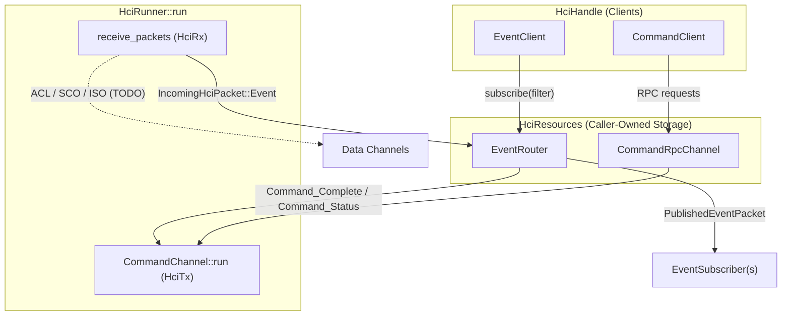

# Objective

Define the top-level structure of the `sapphire-hci` crate: how shared HCI
storage, the controller runner task, client handles, transport halves, and the
per-packet-type subsystems (`EventRouter`, `CommandChannel`, and future ACL,
SCO, and ISO data channels) fit together in a `#![no_std]`, heapless
environment.

Detailed internal designs of individual subsystems (such as
[RFC 0005: CommandChannel](0005_command_channel.md)) are covered in their own
documents.

# Background

A Bluetooth host communicates with a controller over a single HCI transport
carrying commands, events, and ACL, SCO, and ISO data packets. Multiple host
subsystems (such as GAP procedures, discovery, and connection managers) need to
send commands and subscribe to events concurrently, while a single supervision
loop owns the transport halves and drives controller I/O until a fatal error
requires a controller reset.

In Sunstone, all state must live in caller-owned, fixed-capacity storage
configured through traits ([RFC 0003](0003_async_infrastructure.md),
[RFC 0004](0004_platform_agnostic_synchronization.md)) without heap allocation.

# Requirements

- **Caller-Owned Storage (`HciResources`)**: Hold the shared channels and
  routing state (the `EventRouter` and command `RpcChannel`) in a single struct
  that splits into a runner and client handles by borrow.
- **Single Supervision Entry Point (`HciRunner`)**: Drive the transport halves
  (`HciTx` and `HciRx`), running `CommandChannel` alongside the inbound packet
  loop until a fatal [`HciError`] occurs.
- **consumed-on-Run Lifecycle**: Consume `HciRunner` when `run` starts so state
  from a failed controller session cannot leak into a subsequent session without
  recreating the HCI layer after resetting the controller.
- **Independent Client Handles (`HciHandle`)**: Expose plain `pub` client fields
  (`commands: CommandClient`, `events: EventClient`, and future data clients)
  that upper layers can move out and clone independently.
- **Subsystem Decoupling**:
  - `HciRunner` reads `IncomingHciPacket`s from `HciRx` and dispatches event
    buffers to `EventRouter` (and data buffers to future data channels).
  - `EventRouter` validates event packets and distributes them to interested
    subscribers, delaying further reads from `HciRx` when its queue is full so
    backpressure propagates to the transport.
  - `CommandChannel` subscribes to `EventRouter` for `Command_Complete` and
    `Command_Status` events and runs its own `run` loop processing requests from
    `CommandClient`s over `HciTx`.

---

# Design

## System Architecture



## Core Components

### 1. Configuration (`HciCfg`)

`HciCfg<'buf>` groups the configuration types for an HCI instance:

```rust
pub trait HciCfg<'buf>: Sized + 'buf {
    type EventBroadcastCfg: BroadcastCfg;
    type HciTx: HciTx;
    type HciRx: HciRx<'buf>;
    type CommandPoolCfg: PoolCfg;
    type CommandRpcCfg: RpcCfg;
}
```

### 2. Transport Traits (`HciRx`, `HciTx`, `IncomingHciPacket`)

The transport is split into receive (`HciRx`) and send (`HciTx`) halves so
inbound packet reception and outbound command/data transmission can proceed
concurrently without sharing a transport mutex:

```rust
pub trait HciRx<'buf> {
    type Cfg: HciRxCfg<'buf>;

    async fn next_packet(&mut self) -> Result<IncomingHciPacket<'buf, Self::Cfg>, TransportError>;
}

pub trait HciTx {
    async fn send_packet(&mut self, packet: impl AsRef<[u8]>) -> Result<(), TransportError>;
}

pub enum IncomingHciPacket<'buf, Cfg: HciRxCfg<'buf>> {
    Event(RwSlotGuard<'buf, Vec<u8, Cfg::EventStorage>, Cfg::EventPool>),
    Acl(ObjectGuard<'buf, Vec<u8, Cfg::AclStorage>, Cfg::AclPool>),
    Sco(ObjectGuard<'buf, Vec<u8, Cfg::ScoStorage>, Cfg::ScoPool>),
    Iso(ObjectGuard<'buf, Vec<u8, Cfg::IsoStorage>, Cfg::IsoPool>),
}
```

Packets carried by `IncomingHciPacket` and `HciTx::send_packet` are HCI packets
without an H4 packet indicator byte; the transport implementation handles any
wire framing and claims inbound buffers from the pool corresponding to the
packet type.

> [!NOTE]
> `HciRx` and `HciTx` will be migrated to `Stream` and `Sink` traits, and
> `HciTx` will accept a typed outgoing packet enum once data channels are added.

### 3. Storage, Runner, and Clients (`HciResources`, `HciRunner`, `HciHandle`)

```rust
pub struct HciResources<'buf, Cfg: HciCfg<'buf>> {
    router: HciEventRouter<'buf, Cfg>,
    commands: CommandRpcChannel<'buf, Cfg>,
}

impl<'buf, Cfg: HciCfg<'buf>> HciResources<'buf, Cfg> {
    pub fn new() -> Self;
    pub fn split(&mut self) -> (HciRunner<'_, 'buf, Cfg>, HciHandle<'_, 'buf, Cfg>);
}

pub struct HciRunner<'r, 'buf, Cfg: HciCfg<'buf>> { /* ... */ }

impl<'r, 'buf, Cfg: HciCfg<'buf>> HciRunner<'r, 'buf, Cfg> {
    pub async fn run(self, tx: Cfg::HciTx, rx: Cfg::HciRx) -> Result<Infallible, HciError>;
}

pub struct HciHandle<'r, 'buf, Cfg: HciCfg<'buf>> {
    pub commands: CommandClient<'r, 'buf, Cfg>,
    pub events: EventClient<'r, 'buf, Cfg>,
    // TODO(535983448): Add a client for each data channel.
}
```

- **`HciResources`** owns the `EventRouter` and the command `RpcChannel`.
  Calling `split(&mut self)` borrows those resources to produce one `HciRunner`
  and one `HciHandle`.
- **`HciRunner::run`** consumes the runner, constructs a `CommandChannel`
  (which subscribes to `EventRouter` for command completion/status events), and
  runs `CommandChannel::run` concurrently with `HciRunner::receive_packets` via
  `futures::try_join!`:
  - `CommandChannel::run` processes requests from `CommandClient`s and writes
    command packets to `tx`.
  - `HciRunner::receive_packets` reads `IncomingHciPacket`s from `rx` and
    forwards `IncomingHciPacket::Event` buffers to `EventRouter::route_event`
    (and future data packets to their respective channels). If the event channel
    is full, `route_event` waits before returning so `rx.next_packet()` is not
    polled again until space is freed, signaling backpressure to the transport.
- **`HciHandle`** is a plain struct with public `commands` and `events` fields
  so the caller can destructure it and distribute `CommandClient` (cloneable)
  and `EventClient` (copyable) across host subsystems.

### 4. Error Handling and Controller Reset (`HciError`)

`HciRunner::run` only returns when an unrecoverable error occurs:

```rust
pub enum HciError {
    Transport(#[from] TransportError),
    UnexpectedCommandResponse,
    MalformedCommandResponse,
    ControllerError,
}
```

Non-fatal command rejections (such as a `Command_Status` error code from the
controller) are reported to the calling `CommandClient` as a `CommandError`
without stopping `HciRunner::run`. Fatal errors indicate that the transport has
failed or the controller's state can no longer be trusted; dropping or exiting
`HciRunner::run` cancels any in-flight command with `CallError::ServerCancel`
and closes the command channel so the supervisor can reset the controller and
initialize a fresh `HciResources`.

---

# Documentation & Examples

```rust
let mut resources = HciResources::<MyHciCfg>::new();
let (runner, HciHandle { commands, events }) = resources.split();

// Subscribe to events before `run` starts.
let mut sub = events
    .subscribe(|evt| match evt.header().event_code().try_read() {
        Ok(EventCode::INQUIRY_COMPLETE) => Interest::Interested,
        _ => Interest::Uninterested,
    })
    .expect("Subscription within capacity");

// Spawn the runner task; if it returns an `HciError`, reset the controller.
scope.spawn(async move {
    let (tx, rx) = open_transport();
    let Err(error) = runner.run(tx, rx).await;
    // Reset the controller...
});

// Send a synchronous command (HCI_Reset) and await Command_Complete.
let event = commands.send_command(reset_command).await??;

// Send an asynchronous command (HCI_Disconnect) and await Command_Status.
commands.start_command(disconnect_command).await??;
```

---

# Alternatives Considered

1. **Single monolithic loop vs. composing `CommandChannel::run` and `EventRouter` in `HciRunner`**:
   - *Alternative*: Have `HciRunner` directly manage command state and parse
     command events inline before publishing to `EventRouter`.
   - *Decision*: Keep request processing and command event handling inside
     `CommandChannel::run` (subscribing to `EventRouter` for command events),
     and keep event validation and publishing inside `EventRouter`, with
     `HciRunner` joining them over the split `HciTx`/`HciRx` transport halves.
     This keeps each subsystem self-contained while still presenting a single
     `HciRunner::run` entry point to the integrator.
2. **Failing on a full event channel vs. backpressure**:
   - *Alternative*: Fail `HciRunner::run` immediately if an event arrives when
     the broadcast queue is full.
   - *Decision*: Delay reading the next packet from `HciRx` until the event
     channel has space, propagating backpressure to the underlying transport.

---

# Future Work

- **ACL, SCO, and ISO Data Channels**: Add data channel routing in `HciRunner`
  and data clients in `HciHandle`.
- **`Stream` / `Sink` Transport Traits**: Replace `HciRx` and `HciTx` with
  `Stream` and `Sink` traits and introduce a typed outgoing HCI packet enum.
- **Type-Erased Pool Guards**: Avoid propagating pool storage and configuration
  types through `HciCfg`.
