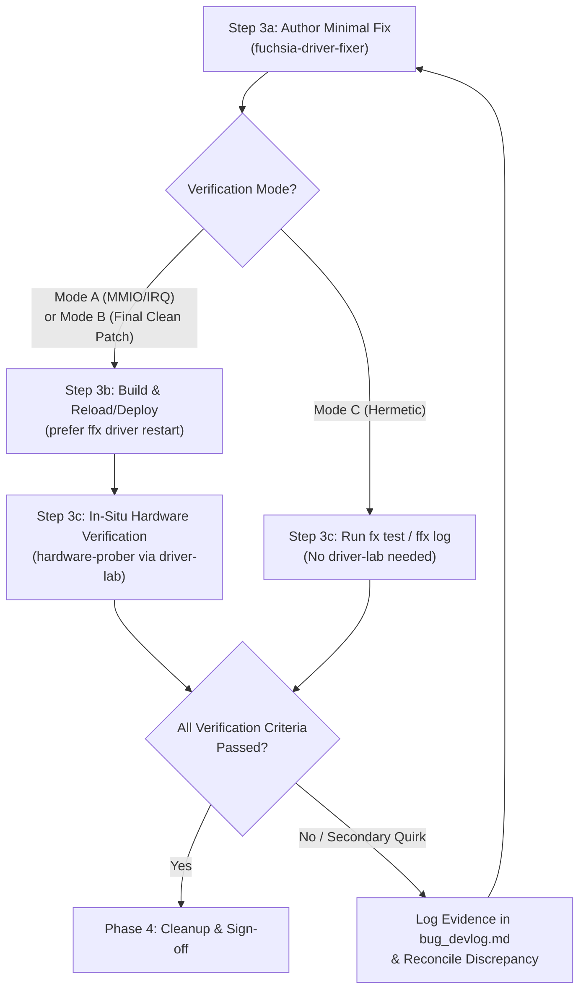

# Skill: AutoDA Fix (`autoda-fix`)

## Purpose

Orchestrate a closed-loop, empirical workflow to investigate and fix bugs in
existing Fuchsia drivers using the **lightest-weight, highest-signal
verification mode** for the bug class (`driver-lab` Phases 2 & 3 `in-situ` mode
or hermetic tests/logs):

1.  **Start from a bug** that describes a hardware, concurrency/state-machine,
    or driver logic problem.
2.  **Select the Adaptive Verification Mode (Mode A, B, or C) and front-load all
    environment & policy questions** after a fast initial reconnaissance so the
    autonomous loop runs unblocked.
3.  **Investigate the problem** using the selected verification mode --
    triangulating live silicon or software `StateBank` state
    (`driver_lab_rust::embedded`) against the Fuchsia driver source, reference
    Linux drivers, and vendor datasheets/TRMs (or reproducing deterministically
    via unit/realm tests in Mode C).
4.  **Write a minimal, surgical fix** via the `fuchsia-driver-fixer` subagent.
5.  **Verify the fix** via `hardware-prober` (`driver-lab` `target-audit.jsonl`
    + hashed evidence bundle for Modes A & B) or `fx test` / `ffx log` (for Mode
      C).
6.  **Loop steps 4 and 5** autonomously until every verification criterion in
    `bug_spec.md` is satisfied.

---

## 1. Subagent-Centric Architecture (Hub & Spokes)

The primary agent acts as the **Bug Orchestrator (Hub)** and coordinates four
specialized, fit-for-purpose subagents:

```text
                      ┌────────────────────────────────────┐
                      │       Bug Orchestrator (Hub)       │
                      │ • Owns bug_spec.md & bug_devlog.md │
                      │ • Selects Mode A / Mode B / Mode C │
                      │ • Front-loads user alignment       │
                      │ • Drives Investigate → Fix ↔ Verify│
                      └──────┬──────────┬───────────┬──────┘
                             │          │           │
        ┌────────────────────┘          │           └────────────────────┐
        ▼                               ▼                                ▼
┌──────────────────────┐     ┌──────────────────────┐     ┌──────────────────────────┐
│ Static Triangulation │     │   hardware-prober    │     │   fuchsia-driver-fixer   │
│ • linux-driver-expert│◄───►│ (In-Situ Driver-Lab) │◄───►│ (Surgical Driver Fixer)  │
│ • datasheet-         │     │ • Mode A: MMIO / IRQ │     │ • Minimal diff bias      │
│   researcher         │     │ • Mode B: StateBank  │     │ • Proxy-as-lib &         │
│ • Comparative delta  │     │   knobs & triggers   │     │   StateBank wiring       │
│   vs Fuchsia driver  │     │ • Hashed evidence    │     │ • Targeted bug patches   │
└──────────────────────┘     └──────────────────────┘     └──────────────────────────┘
```

### Subagent Setup & Execution Modes

Upon starting the workflow, establish the subagent execution mode:

1.  **Multi-Agent Mode (Recommended):** If `define_subagent` and
    `invoke_subagent` are available:
   * Read [`scripts/register_subagents.py`](scripts/register_subagents.py) and
     the role specifications under `references/`:
     - [`references/fuchsia-driver-fixer.md`](references/fuchsia-driver-fixer.md)
     - [`references/hardware-prober.md`](references/hardware-prober.md)
     - [`references/linux-driver-expert.md`](references/linux-driver-expert.md)
     - [`references/datasheet-researcher.md`](references/datasheet-researcher.md)
   * Define any missing subagents via `define_subagent` using the configurations
     in `scripts/register_subagents.py`.
   * Delegate tasks via `invoke_subagent` (and follow up with existing subagent
     instances via `send_message` across iterations of the Fix $\leftrightarrow$
     Verify loop to preserve context).
2.  **Single-Agent Progressive Mode:** If subagent tools are unavailable,
    execute each phase directly while strictly adopting the role constraints in
    `references/*.md` and maintaining the dual artifacts.

Also read the companion [`driver-lab` skill](../driver-lab/SKILL.md) for CLI,
`StateBank`, and plan schema specifics.

---

## 2. Deliverables & Dual-Artifact Discipline

Maintain two living markdown files in the workspace or artifact directory
throughout the session. Both files must begin with a structured YAML frontmatter
block initialized in Phase 0 and finalized in Phase 4 (kept local to the
session; do not upload these artifacts to external trackers):

```yaml
---
skill: autoda-fix
conversation_id: "<root_orchestrator_conversation_id>"
trajectory_id: "<trajectory_id_or_empty>"
bug_id: "<buganizer_issue_id>"
gerrit_change_id: "<I..._or_pending>"
target_driver: "<driver_name_or_package>"
verification_mode: "<Mode A | Mode B | Mode C>"
outcome: "<IN_PROGRESS | VERIFIED_FIXED | DIAGNOSED_ONLY | BLOCKED>"
fix_verify_iterations: 0
diag_manifest_sha256: "<sha256_or_n/a>"
verify_manifest_sha256: "<sha256_or_n/a>"
---
```

* **`conversation_id`**: Always record the **root Bug Orchestrator's**
  conversation ID from the session context (never a child subagent's
  conversation ID).
* **`trajectory_id`**: Populate if available in the environment (for example,
  via `/google/bin/releases/gemini-agents-reflection/reflection_cli info -c
  <conversation_id> --trajectory_id_only`); otherwise leave as `""`.

### 2.1 `bug_spec.md` (Living Diagnosis, Fix & Verification Contract)

The single source of truth for the bug investigation and resolution:
* **Structured YAML Frontmatter:** Session, bug, CL, mode, and outcome metadata
  block (`--- ... ---`).
* **Bug & Target Context:** Bug ID/summary, reproduction symptoms, selected
  **Verification Mode (`Mode A`, `Mode B`, or `Mode C`)**, target selector, node
  ID, component moniker (e.g. `bootstrap/base-drivers:spi-0`), and bound driver
  URL.
* **Standing Autonomy & Deployment Policy:** Upfront user decisions recorded in
  Phase 0 (verification mode, approved deployment/reload command,
  instrumentation retention policy, consent policy, recovery method).
* **Suspect Register / StateBank & Resource Model:** Concise breakdown comparing
  TRM/Linux or invariant expectations, current Fuchsia driver behavior, live
  pre-fix observations (`mmio0` or `state0`), and post-fix target values.
* **Hypotheses & Verified Root Causes (`H1..Hn`)  --  Bulleted List (NEVER a
  Table):** Format all hypotheses and verified root causes as a structured
  **bulleted list** with indented sub-bullets (**never** as a multi-column
  Markdown table, which wraps poorly and is difficult to read in narrow panes).
  Mark each item `[UNTESTED]`, `[CONTRADICTED]`, or `[VERIFIED]`. Every
  `[VERIFIED]` entry in Modes A/B **must** cite a canonical plan digest,
  finalized `manifest.json` SHA-256 hash, and `target-audit.jsonl` sequence
  numbers (or `fx test` / `ffx log` output in Mode C):
  ```markdown
  ## 4. Hypotheses & Verified Root Causes
  - **H1** `[VERIFIED]`  --  **<Short summary title>**
    - **Location:** [`<file.cc>`](file:///path/to/file.cc#L10-L25) (`<ClassOrFunction>`)
    - **Root Cause:** <Explanation of the hardware, concurrency, or logic bug>
    - **Evidence:** <Plan digest / `manifest.json` SHA-256 / `target-audit.jsonl` seq, or `fx test` / `ffx log` result>
    - **Implemented Fix:** <Concise summary of the surgical code fix>
  ```
* **Surgical Fix Summary & Verification Criteria:** Exact minimal code change
  and the declarative `plan.json` (or regression test) + functional checks
  required to close the loop.

### 2.2 `bug_devlog.md` (Append-Only Chronological Journal)

An append-only engineering log recording every step (prefixed with the same YAML
frontmatter block as `bug_spec.md`):
* Phase 0 reconnaissance findings, verification mode selection rationale, and
  upfront user alignment answers.
* Instrumentation diffs (`DriverLabBuilder`, `StateBank`, `debug.shard.cml`).
* Subagent prompts, comparative findings, and discrepancy reconciliations.
* Probe plan digests, `grants.toml` additions, run IDs, and drained
  `target-audit.jsonl` sequence ranges.
* Every iteration of the Phase 3 **Write Fix $\leftrightarrow$ Verify** loop
  (code diff summary, build/deploy status, post-fix evidence bundle path or test
  output, and pass/retry rationale).

---

## 3. Workflow Protocol

### Phase 0: Eager Artifact Initialization, Reconnaissance, Mode Selection & Upfront User Alignment

> **Core Autonomy & Live Observability Principle:** Eagerly create `bug_spec.md` and `bug_devlog.md` and surface the `AutoDA: Fix & Verify` sidecar pane (if installed) **immediately at the start of Phase 0** -- before running reconnaissance or blocking on `ask_question` -- so the sidecar immediately has an active source to select and displays live progress from the very beginning. Then perform a fast, read-only reconnaissance, classify the bug into the right verification mode (Mode A, B, or C), formulate concrete recommendations based on the actual target and driver packaging, and ask the user **all** alignment questions upfront in one consolidated step.

#### Step 0.1: Eager Artifact Initialization & Sidecar Pane Popup (MUST Execute First)
1.  **Eagerly Create `bug_spec.md` and `bug_devlog.md` Immediately:**
   * As your **very first tool calls** upon invoking `/autoda-fix` (before
     reconnaissance commands or `ask_question`), create `bug_spec.md` and
     `bug_devlog.md` in the active conversation artifact directory
     (`<appDataDir>/brain/<conversation-id>/`) using `write_to_file` (with
     `ArtifactMetadata`: `UserFacing: true`, `RequestFeedback: false`).
   * Prefix both files with the structured YAML frontmatter block (`skill:
     autoda-fix`, root `conversation_id`, `trajectory_id`, `bug_id` extracted
     from the user prompt, `gerrit_change_id: "pending"`, `target_driver:
     "investigating"`, `verification_mode: "Pending Phase 0 Selection"`,
     `outcome: "IN_PROGRESS"`, `fix_verify_iterations: 0`,
     `diag_manifest_sha256: "n/a"`, `verify_manifest_sha256: "n/a"`).
   * In `bug_spec.md`, populate the initial Bug ID, title/symptom summary, and
     skeleton sections (`## 1. Bug & Target Context`, `## 2. Standing Autonomy &
     Deployment Policy`, `## 3. Suspect Register / StateBank Model`, `## 4.
     Hypotheses & Verified Root Causes` using the bulleted list format -- never
     a table).
   * In `bug_devlog.md`, append the initial `## Phase 0: Bug Intake &
     Reconnaissance` entry noting that artifacts are initialized and
     reconnaissance is starting.
2.  **Pop Up / Surface the AutoDA Sidecar Pane (if installed):**
   * If the `autoda` UI plugin sidecar (`autoda/autoda_control`) is
     installed/running (e.g.
     `~/.gemini/config/plugins/_autoda/sidecars/autoda_control/sidecar.json` or
     `~/.gemini/config/plugins/autoda/sidecars/autoda_control/sidecar.json`
     exists), immediately include the sidecar launch pill `[AutoDA: Fix &
     Verify](sidecar://autoda/autoda_control/)` at the top of your Phase 0
     message so the user can pop open the live observability pane right away
     with the current conversation already populated in the `Source:` selector.

#### Step 0.2: Fast Read-Only Reconnaissance
1.  **Read the Bug & Locate the Fuchsia Driver:**
   * Inspect the bug report or user symptom description.
   * Locate the suspect driver in the Fuchsia tree (`BUILD.gn` or `BUILD.bazel`,
     `meta/*.cml`, and Rust or C/C++ source files).
   * Check whether the driver is packaged in `bootfs` / `bootstrap/base-drivers`
     or as a reloadable non-bootfs package, and whether it already imports
     `driver_lab_rust` / `driver_lab_cpp` and
     `//src/devices/driver-lab/meta/debug.shard.cml`.
2.  **Inspect Build & Target State:**
   * Check `fx status`, `fx get-device`, `ffx target list`, and `$(fx
     get-build-dir)/args.gn` (verifying `//src/devices/driver-lab:pkg`,
     `//tools/driver-lab:host`, and `enable_driver_lab`).
   * If the target is reachable and `driver-lab.pyz` is built, run:
     ```bash
     cd $(fx get-build-dir)
     python3 host_x64/obj/tools/driver-lab/driver-lab.pyz list --debug-capable --target <target>
     ```
     to check if the suspect driver node is already active and exposing
     `fuchsia.driver.lab.Service`.
3.  **Update `bug_spec.md` & `bug_devlog.md` with Reconnaissance Baseline:**
   * Immediately update `target_driver`, `verification_mode` (recommended),
     component moniker, and reconnaissance findings in `bug_spec.md` and
     `bug_devlog.md` before calling `ask_question` so the sidecar reflects the
     discovered driver and recommended mode while awaiting user alignment.

#### Step 0.3: Adaptive Verification Mode Selection & Upfront User Alignment

Classify the bug and select one of the three **Verification Modes**:

| Mode | Bug Class | Primary Mechanism | When to Choose |
| :--- | :--- | :--- | :--- |
| **Mode A: Hardware Register / Interrupt Loop (`in-situ` MMIO/IRQ)** | Hardware register programming, bitfields, clocks, FIFOs, power/reset sequencing, or interrupts | `driver-lab` `in-situ` MMIO (`mmio_read32`, `mmio_write32`, `mmio_poll32`) and interrupt tapping (`wait_for_interrupt`) | Bug depends on real hardware registers or IRQ delivery on target silicon. |
| **Mode B: In-Situ Software State & Knob Loop (`in-situ` `StateBank` / `StateVmoBank`)** | Concurrency/race conditions, lock ordering, state-machine transitions, teardown guards, or retry/timeout tuning | `driver-lab` `in-situ` `StateBank` (Rust) or `StateVmoBank` / `driver_lab_global_*` (C/C++) (`state_read32`, `state_poll32`, `knob_write32`, `trigger_write32`) | Bug involves in-driver software state or timing windows on live hardware where a **single instrumentation build** + runtime knobs avoids repeated OTA/reboot cycles. |
| **Mode C: Hermetic Test & Log Verification Loop (No `driver-lab` Required)** | Pure logic bugs, protocol/message parsing bugs, FIDL error mapping, or deterministic lifecycle bugs | `fx test` (unit/driver realm tests) and/or `ffx log` on target | Bug can be deterministically reproduced and verified via a unit/realm test or log assertion. **Never shoe-horn `driver-lab` into Mode C bugs** when a unit test or log check is faster and more direct. |

Based on Step 0.2 and the selected mode, use `ask_question` (or a single
structured prompt) with `(Recommended)` prefixed on the best-fit option for each
decision needed to run unblocked (and include the `[AutoDA: Fix &
Verify](sidecar://autoda/autoda_control/)` pill in your accompanying message if
the sidecar is installed):

1.  **Verification Mode & Strategy:**
   * Recommend **Mode A** (`in-situ` MMIO/IRQ), **Mode B** (`in-situ`
     `StateBank` / `StateVmoBank` single-build loop), or **Mode C** (hermetic
     `fx test` / `ffx log` loop) with a brief explanation of why it fits the
     bug.
2.  **Driver Deployment / Fast Reload Mechanism & Standing Loop Authorization:**
   * For reloadable non-bootfs drivers, recommend **fast in-place reload** via
     `ffx driver restart <driver_url>` (or `ffx driver disable <driver_url>` +
     `ffx driver enable <driver_url>`) after `fx build` before falling back to
     full `fx ota` + device reboot.
   * For `bootfs` / non-reloadable drivers, recommend `fx build && fx ota` (and
     reboot if needed), or in **Mode B** highlight that only a **single
     instrumentation build/deploy** is needed before running the zero-compile
     `StateBank` experimentation loop.
   * Obtaining explicit upfront approval here authorizes the chosen deployment
     command across the workflow without re-prompting.
3.  **In-Situ `driver-lab` Instrumentation Policy (Modes A & B):**
   * Recommend wiring `DriverLabBuilder` (Rust) or `driver_lab::Builder` (C/C++)
     (with MMIO/IRQ in Mode A or `StateBank` / `StateVmoBank` `"state0"` in Mode
     B) + `debug.shard.cml`, and ask whether to **keep** the
     `enable_driver_lab`-gated integration in the final diff or **strip**
     temporary diagnostic knobs/instrumentation once verified.
4.  **Register / StateBank Access & Consent Policy (Modes A & B):**
   * Recommend pre-authorizing `hardware-prober` to persist exact read grants
     (`grants.toml`) for non-destructive registers/`state0` slots and to execute
     one-shot `--consent` writes (`mmio_write32`, `knob_write32`,
     `trigger_write32`) during experiments.
5.  **Out-of-Band Recovery (Modes A & B, if applicable):**
   * Confirm whether an out-of-band power-cycle/serial command is available if a
     probe wedges the target, or if recovery should rely on `ffx target reboot`.

#### Step 0.4: Record Standing Policies in Artifacts
Update `bug_spec.md` and `bug_devlog.md` with the user's confirmed verification
mode and standing policies before entering Phase 1.

---

### Phase 1: Instrumentation & Triangulated Static Analysis

#### Mode A: Hardware Register / Interrupt Instrumentation
* If the target driver does not yet expose `fuchsia.driver.lab.Service` (or
  lacks required `writable_registers` / `hard_denied_ranges`):
  1.  Task `fuchsia-driver-fixer` to add minimal `driver_lab_rust::embedded`
      (Rust) or `driver_lab_cpp` (C/C++) instrumentation (`DriverLabBuilder` /
      `driver_lab::Builder`, `with_mmio` / `AddMmioBuffer`,
      `with_writable_registers` / `SetWritableRegisters`,
      `with_hard_denied_ranges` / `SetHardDeniedRanges` for destructive FIFOs,
      `with_interrupt` / `AddInterrupt`, `with_quiesce_hook` / `SetQuiesceHook`,
      and `debug.shard.cml` in GN or Bazel).
  2.  Build and deploy using the standing deployment policy (preferring `ffx
      driver restart <driver_url>` when reloadable).
  3.  Task `hardware-prober` to verify `driver-lab list --debug-capable` and run
      `driver-lab describe --moniker <component_moniker> --node <node_id>`.
* Concurrently invoke `linux-driver-expert` and/or `datasheet-researcher` to
  compare register programming, bitmasks, clock/divider math, FIFO watermarks,
  and ordering against the reference Linux driver and vendor TRM.

#### Mode B: Single-Build Software Bug Playbook  --  Phase 1 (Single Instrumentation Build)
For concurrency/race bugs, state-machine bugs, and timeout/retry tuning, avoid
repeated compile/OTA cycles by instrumenting once with `StateBank` (Rust) or
`StateVmoBank` / `driver_lab_global_*` (C/C++):
1.  Task `fuchsia-driver-fixer` to wire a `"state0"` bank via
    `lab_builder.with_state_bank("state0", state_bank)` (Rust) or
    `lab_builder.AddStateVmoBank("state0", state_bank, writable_knob_offsets)`
    (C/C++) containing:
   * **Observable state slots (`define_state_slot` / `SetState32` /
     `driver_lab_global_set_state_u32`)**: Lock-free `AtomicU32` counters/flags
     tracking invariant violations, active state transitions, or in-flight
     operations.
   * **Fault / race-window injection knob (`define_knob` / `GetKnob32` /
     `driver_lab_global_get_knob_u32`)**: Runtime-tunable delay
     (`KNOB_RACE_DELAY_US`) or threshold that widens a suspect race window on
     demand.
   * **Candidate fix-toggle knob (`define_knob` / `GetKnob32` /
     `driver_lab_global_get_knob_u32`)**: Runtime boolean flag
     (`KNOB_FIX_ENABLED`, default `0`) that gates the proposed synchronization
     guard or state-machine fix at runtime.
   * **Diagnostic trigger (`define_trigger`)**: Deterministic callback
     (`TRIGGER_CONCURRENT_OP`) that exercises the suspect concurrent or
     state-transition path on demand when written from the host.
2.  Build and deploy **once** (`ffx driver restart <driver_url>` if reloadable,
    or `fx ota`).
3.  Task `hardware-prober` to run `driver-lab describe` and confirm `"state0"`
    is listed in `resources` with its per-resource digest.

#### Mode C: Hermetic Test & Log Analysis (No `driver-lab`)
* Inspect the suspect logic, parser, or lifecycle handler directly in the driver
  source and existing unit/realm tests.
* Formulate the root-cause hypothesis in `bug_spec.md` and design a
  deterministic failing unit or driver realm test case (`fx test`).

---

### Phase 2: Empirical Investigation & Root-Cause Proof

#### Mode A: In-Situ Hardware Register Investigation
1.  **Execute Diagnostic In-Situ Probes:**
   * Delegate to `hardware-prober` to run `inspect` or `run --plan <plan.json>`
     (`mmio_read32`, `mmio_poll32`, `wait_for_interrupt`) against `--moniker
     <component_moniker> --node <node_id>`.
   * Resolve read grants in `grants.toml` using the **per-resource digest**
     (`resources[i].digest`).
2.  **Test Live Quiesced Mutations (Optional Fast Proof):**
   * Before spending a compile/deploy cycle, if a hypothesis predicts that
     changing a writable register resolves the bad state, have `hardware-prober`
     execute an in-situ mutating plan (`mmio_write32` with `readback: true` and
     `--consent`).
3.  **Confirm Root Cause:**
   * Reconcile `operations.jsonl` and `target-audit.jsonl` with
     `linux-driver-expert` and `datasheet-researcher`, and mark the confirmed
     hypothesis `[VERIFIED]` in `bug_spec.md`.

#### Mode B: Single-Build Software Bug Playbook  --  Phase 2 (Zero-Compile Experimentation Loop)
With the single instrumented build active on the target, `hardware-prober`
proves both reproduction and resolution in the **same boot** without
recompiling:
1.  **Run Repro Plan (`KNOB_FIX_ENABLED = 0`):**
   * Execute an in-situ plan (`--consent`) using `knob_write32` (never `mmio_*`
     on `"state0"`) to set the race-window/fault knob (e.g. `KNOB_RACE_DELAY_US
     = 500`) and ensure `KNOB_FIX_ENABLED = 0`, `trigger_write32` to fire the
     concurrent operation trigger, and `state_read32` to confirm the invariant
     violation counter increments (`> 0`).
2.  **Run Fix Proof Plan in the Same Boot (`KNOB_FIX_ENABLED = 1`):**
   * Immediately run a second plan (or combined sequence) using `knob_write32`
     to set `KNOB_FIX_ENABLED = 1`, `trigger_write32` to fire the exact same
     workload, and `state_read32` / `state_poll32` to confirm no new invariant
     violations occur and `STATE_BUSY_FLAG` returns cleanly to `0`.
3.  **Confirm Root Cause & Fix Efficacy:**
   * Record both the reproduction audit trail and the fix-proof audit trail from
     `target-audit.jsonl` in `bug_spec.md` and `bug_devlog.md`.

#### Mode C: Reproduce via Hermetic Unit/Realm Test
* Run `fx test <test_target>` (or inspect `ffx log dump`) to confirm the
  deterministic reproduction before applying the production fix.

---

### Phase 3: The Surgical Fix & Verification Loop

Execute the closed loop for the active mode until verification passes:



#### Step 3a: Write Surgical Fix (`fuchsia-driver-fixer`)
* Instruct `fuchsia-driver-fixer` to implement the **smallest, most localized
  code change** that genuinely fixes the verified root cause, checking all four
  items in the **Critical Driver Bug & Hardware Invariants Checklist** in
  [`references/fuchsia-driver-fixer.md`](references/fuchsia-driver-fixer.md)
  (FIFO `TXFLR` shift-register headroom `(FIFO_SIZE -
  tx_words).saturating_sub(1)`, moving premature bring-up interrupt arming to
  the start of the async IRQ consumer task rather than clearing overflow before
  a check, extracting and dispatching completed RX ring buffers *before*
  awaiting `pop_wait_available().await`, and committing `is_connected = true`
  *inside* the attach debounce task after the timer expires):
  - **Mode A:** Apply the exact register/bitfield/sequence/interrupt fix.
  - **Mode B (Phase 3  --  Clean Final Patch):** Replace the temporary
    `KNOB_RACE_DELAY_US` and `KNOB_FIX_ENABLED` runtime knobs with the clean,
    unconditional production synchronization/state fix proven in Phase 2, and
    add a permanent unit/realm regression test.
  - **Mode C:** Apply the minimal logic/protocol/lifecycle fix and add/update
    the unit/realm regression test.
* Pass the root orchestrator's `conversation_id` and `bug_id` when delegating to
  `fuchsia-driver-fixer` so any git commit created or amended includes the
  required `/autoda-fix` commit trailers (see Phase 4 Step 3).
* **Anti-Refactor Guardrail:** Do not reorganize unrelated structs, rename
  existing APIs, or refactor surrounding code.
* Verify clean compilation (`fx build`, `fx clippy` for Rust) and run local
  unit/realm tests (`fx test`).

#### Step 3b: Deploy or Reload Updated Driver (Modes A & B, or Target Log Check in Mode C)
* Prefer `ffx driver restart <driver_url>` (or `ffx driver disable` + `enable`)
  for reloadable non-bootfs drivers; otherwise execute the standing `fx ota` /
  reboot policy approved in Phase 0.
* Wait for target readiness (`ffx target wait`, `ffx target echo`) and confirm
  the driver is bound and active.

#### Step 3c: Verify Fix
* **Modes A & B (`hardware-prober`):**
  1.  Refresh target description (`driver-lab describe --moniker
      <component_moniker> --node <node_id>`) to capture the new `boot_id` and
      `resource_digest`.
  2.  Execute the **Verification Probe Plan** (`mode: "in-situ"`) via
      `driver-lab run`:
     - **Register / State Ground Truth:** Confirm in `target-audit.jsonl`
       (`status: "ok"`) that the patched driver maintains the exact expected
       hardware register (`mmio0`) or software invariant (`state0`) values.
     - **Runtime & Interrupt Health:** Verify interrupt delivery
       (`wait_for_interrupt`), poll completion (`mmio_poll32` / `state_poll32`),
       and clean device logs (`serial.log` / `ffx log dump`).
     - **Evidence Integrity:** Verify `exit_category == 0` and all artifact
       hashes in `manifest.json`.
* **Mode C:**
  1.  Run `fx test <test_target>` to confirm the new regression test and all
      existing suite tests pass.
  2.  If on-target log verification applies, check `ffx log dump` to confirm the
      symptom is resolved.

#### Step 3d: Evaluate Iteration & Loop
* Log the iteration's diff, run ID / test output, plan digest, `manifest.json`
  hash, and audit results in `bug_devlog.md`.
* If any assertion fails, feed the evidence back into analysis and repeat from
  **Step 3a**.
* Once all verification criteria in `bug_spec.md` pass, exit the loop and
  proceed to Phase 4.

---

### Phase 4: Post-Verification Cleanup, Commit Attribution & Final Audit

1.  **Apply Instrumentation Retention Policy:**
   * Follow the user's Phase 0 decision regarding `driver_lab_rust::embedded`
     instrumentation (always remove temporary fault-injection/fix-toggle knobs
     from Mode B, and either keep clean `enable_driver_lab = is_debug` read-only
     observability or strip instrumentation and rebuild/verify).
2.  **Verify Formatting:**
   * Run `fx format-code` from the appropriate repository root.
3.  **Commit / CL Trailer Attribution:**
   * When creating or amending the git commit / Gerrit CL for the driver fix,
     include the following trailers in the commit message footer so CLs
     generated by `/autoda-fix` can be enumerated and joined back to the
     associated bug and root session:
     ```text
     Bug: <bug_id>
     Test: <verification summary>
     TAG=agy
     TAG: autoda-fix
     CONV: <root_orchestrator_conversation_id>
     Change-Id: I...
     ```
     (Use `Fixed: <bug_id>` instead of `Bug: <bug_id>` when the commit
     completely resolves the issue.)
   * Always include both `TAG=agy` (with `=`) and `TAG: autoda-fix` on separate
     lines alongside `CONV: <root_orchestrator_conversation_id>` (the root Bug
     Orchestrator's conversation ID, not a child subagent's conversation ID).
4.  **Finalize Artifacts:**
   * Update the YAML frontmatter block in both `bug_spec.md` and `bug_devlog.md`
     (`outcome: "VERIFIED_FIXED"` or `"DIAGNOSED_ONLY"` / `"BLOCKED"`,
     `gerrit_change_id`, final `fix_verify_iterations` count,
     `diag_manifest_sha256`, and `verify_manifest_sha256`).
   * Append the final summary to `bug_spec.md` and `bug_devlog.md` linking:
     - Selected Verification Mode (`Mode A`, `Mode B`, or `Mode C`)
     - Pre-fix diagnostic/reproduction evidence
       (`evidence/<diag_run_id>/manifest.json` or failing test log)
     - Surgical driver code fix diff and Gerrit `Change-Id`
     - Post-fix verification evidence (`evidence/<verify_run_id>/manifest.json`
       and/or passing `fx test` results)
