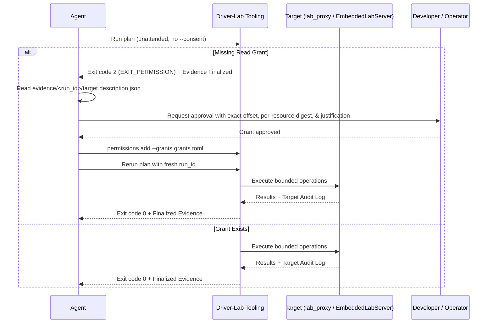

# Driver Lab Skill

This skill teaches agents and developers how to interact with Fuchsia target
hardware and live driver state safely and empirically using **driver-lab** --
via the standalone proxy driver (`lab_proxy`) on unclaimed nodes (Phase 1), the
embedded in-situ debugging library (`driver_lab_rust::embedded`) inside active,
bound drivers (Phase 2), and software `StateBank` slots, runtime knobs, and
diagnostic triggers (Phase 3) -- along with its companion host tooling
(`driver-lab.pyz` / `DriverLab`).

The goal is to allow any agent, skill, or workflow to inspect, probe, configure,
and verify hardware peripherals (MMIO registers, GPIO pins, I2C/SPI buses, and
interrupts) and software state machines without bypassing Fuchsia's security,
capability, or auditing boundaries.

---

## 1. Core Concepts & Architecture

Driver-lab provides a multi-mode access model to Fuchsia hardware:

```text
Host Tooling (CLI / Python API)
        │
        ├── Direct Mode ─────────► Published Protocol on Active Driver
        │                          (fuchsia.hardware.gpio, i2c, spi, etc.)
        │
        ├── Proxy Mode ──────────► lab_proxy.cm (on Unclaimed Dev Node)
        │   (Phase 1)              ├── Target Policy & Ceiling Enforcement
        │                          ├── MMIO Read/Write/Poll/Snapshot
        │                          ├── GPIO / I2C / SPI / Interrupt Endpoints
        │                          └── In-Driver Dispatcher Audit Ring
        │
        └── In-Situ Mode ────────► EmbeddedLabServer (in Active Bound Driver)
            (Phases 2 & 3)         ├── Shared MMIO via VMO Duplication
                                   ├── Software StateBank (Slots, Knobs, Probes, Triggers)
                                   ├── Target Policy & Ceiling Enforcement
                                   ├── Cooperative Quiesce Hook Interlock
                                   ├── Non-Intrusive ISR Interrupt Tapping
                                   └── In-Driver Dispatcher Audit Ring
```

### 1.1 Access Modes

| Mode | Target Component | Appropriate Use Cases | Guarantees |
| :--- | :--- | :--- | :--- |
| **In-Situ Mode** (`in-situ`) | Active bound driver embedding `driver_lab_rust` | Investigating hardware or software state bugs in existing drivers, inspecting live in-flight register state or `StateBank` slots without unbinding or resetting clocks/power, tuning runtime knobs (`define_knob`) and firing diagnostic triggers (`define_trigger`), quiesced mutations, ISR interrupt tapping | Preserves live hardware & software state, target-enforced ceiling policy, cooperative quiesce interlock on writes, in-driver audit ring |
| **Proxy Mode** (`proxy`) | `lab_proxy.cm` bound to an unclaimed node | Pre-driver hardware bringup, private MMIO registers on unclaimed nodes, target-local polling sequences, low-level bus exploration | Target-enforced ceiling policy, fail-closed allowlists, bounded operations, in-driver audit ring |
| **Direct Mode** (`direct`) | Normal driver actively bound | Black-box driver testing, high-level device control via published FIDL protocols, standard GPIO/I2C/SPI protocols | Standard FIDL capability routing, no private MMIO, no target audit ring |
| **Auto Mode** (`auto`) | Dynamic selection | Selecting direct mode if requested capabilities are satisfied without private resources; never downgrades safety | Fails closed if proxy/in-situ guarantees (e.g. MMIO, target audit) are required |

### 1.2 Core Safety Invariants

1.  **Engineering-Only:** `lab_proxy`, `driver_lab_rust` outgoing services
    (`enable_driver_lab = is_debug`), and `debug.shard.cml` are strictly for
    engineering (`eng` and `userdebug`) builds. They **must never** be present
    in production (`user`) builds.
2.  **Fail-Closed Permissions:** Register reads require operator consent. In
    unattended agent runs without `--consent`, unknown reads fail closed with
    exit category `2` while finalizing evidence.
3.  **Ceiling Invariance:** Host grants can narrow the target-side policy
    ceiling, but can **never** widen it. Hard target denials (`hard_denied`
    ranges such as destructive FIFOs) are absolute.
4.  **Persistent Write Prohibition:** Persistent `write` grants in `grants.toml`
    are forbidden. Mutating plans (`mmio_write32`) require explicit target write
    policy (`writable_registers`) and per-run approval (`--consent`).
5.  **Evidence Before Interpretation:** Never treat an empirical probe as
    verified without citing artifacts from a finalized, tamper-proof hashed
    evidence bundle (`manifest.json` written last).
6.  **Independent Recovery:** Serial logging and board power/reset recovery run
    independently of the in-band FIDL experiment channel. A target crash or
    panic is captured out-of-band.

---

## 2. Prerequisites & Environment Setup

### 2.1 Build Configuration

Ensure driver-lab packages and host tooling are in your build universe (and
`enable_driver_lab = true` in `args.gn` if building an engineering variant that
does not default `is_debug = true`):

```bash
fx set core.x64 \
  --with //src/devices/driver-lab:pkg \
  --with //src/devices/driver-lab/testing:pkg \
  --with //tools/driver-lab:host
fx build
```

### 2.2 Host Tool Location

The host CLI binary is built as a self-contained Python zipapp (`pyz`):

```bash
# Path relative to Fuchsia repository root:
$(fx get-build-dir)/host_x64/obj/tools/driver-lab/driver-lab.pyz

# Helper alias for execution:
DRIVER_LAB="python3 $(fx get-build-dir)/host_x64/obj/tools/driver-lab/driver-lab.pyz"
```

> **Note:** Always run host commands with your working directory set to `$(fx get-build-dir)` or ensure the build directory is in your library paths so bundled native `fuchsia-controller` libraries and `host_x64/ffx` resolve cleanly.

### 2.3 Conformance Setup on Emulator

To test or develop against a simulated hardware device on an emulator:

```bash
# 1. Register test root and proxy drivers ephemerally:
ffx driver register fuchsia-pkg://fuchsia.com/lab_root#meta/lab_root.cm
ffx driver register fuchsia-pkg://fuchsia.com/lab_proxy#meta/lab_proxy.cm

# 2. Add a test node matching lab_root bind rules:
ffx driver test-node add lab-station fuchsia.driver.lab.LAB_ROOT=selected

# 3. Verify topology:
ffx driver dump
# Expected hierarchy: [lab-station] -> [proxy-target] bound to lab_proxy.cm
```

---

## 3. Node & Hardware Discovery (Phase 1 & Phase 2)

Before executing probe plans, query the target to locate either **active
debug-capable drivers** (Phase 2 `in-situ`) or **unclaimed hardware nodes**
(Phase 1 `proxy`).

### 3.1 Listing Hardware Nodes

```bash
# List all nodes discovered on the target:
$DRIVER_LAB list --target <target_addr_or_name>

# Phase 2 (In-Situ): Filter for active bound drivers exposing fuchsia.driver.lab.Service:
$DRIVER_LAB list --debug-capable --target <target_addr_or_name>

# Phase 1 (Standalone Proxy): Filter for unclaimed nodes eligible for lab_proxy binding:
$DRIVER_LAB list --unclaimed --target <target_addr_or_name>
```

> **Moniker Mapping Note for In-Situ Drivers:** In `list --debug-capable`, a DFv2 driver node may report `"moniker": "spi-0"` (or similar node name). When passing `--moniker` to `describe`, `inspect`, or `run`, supply the full component moniker (e.g., `"bootstrap/base-drivers:spi-0"` or `"bootstrap/full-drivers:<node_moniker>"` if `:` is not already present).

### 3.2 Describing Node & Embedded Driver Details

Query a specific node or active driver moniker to view its offered resources
(MMIO, GPIO, I2C, SPI, Interrupts), logical sizes, policy digest, and
per-resource digests:

```bash
# Phase 2 (In-Situ active driver):
$DRIVER_LAB describe \
  --moniker "bootstrap/base-drivers:spi-0" \
  --node "spi-0" \
  --target <target_addr>

# Phase 1 (Standalone proxy on unclaimed node):
$DRIVER_LAB describe \
  --node "dev.lab-station.proxy-target" \
  --target <target_addr>
```

Sample output:
```json
{
  "node_id": "spi-0",
  "bound_driver": "fuchsia-pkg://fuchsia.com/dw-spi#meta/dw-spi.cm",
  "boot_id": "a5e7890f-...",
  "proxy_generation": 1,
  "policy_digest": "sha256:9f8e7d...",
  "resource_digest": "sha256:1a2b3c...",
  "resources": [
    {
      "id": 0,
      "name": "mmio0",
      "kind": "mmio",
      "logical_size": 256,
      "digest": "sha256:4d5e6f..."
    },
    {
      "id": 1,
      "name": "irq0",
      "kind": "interrupt",
      "logical_size": 0,
      "digest": "sha256:7a8b9c..."
    }
  ]
}
```

### 3.3 Ad-Hoc Single-Register In-Situ Inspection (Phase 2)

For quick live diagnostics on an active debug-capable driver, `inspect` opens a
temporary read-only session, optionally reads one 32-bit register offset, and
dumps the recent target audit ring:

```bash
$DRIVER_LAB inspect \
  --moniker "bootstrap/base-drivers:spi-0" \
  --node "spi-0" \
  --resource mmio0 \
  --offset 0x00 \
  --target <target_addr>
```

### 3.4 Binding and Unbinding the Standalone Proxy Driver (Phase 1)

For unclaimed development nodes:

```bash
# Bind lab_proxy to an unclaimed node:
$DRIVER_LAB bind-proxy --node "dev.lab-station.proxy-target"

# End proxy access and verify the node is restored to unclaimed state:
$DRIVER_LAB end-proxy --node "dev.lab-station.proxy-target"
```

---

## 4. Operator Read Grants & Consent

Driver-lab enforces fine-grained authorization. Register reads that have not
been explicitly authorized will be blocked.

### 4.1 Grant Storage (`grants.toml`)

Grants are persisted in a human-readable TOML store:

```toml
schema_version = 1

[[read_grants]]
grant_id = "grant-mmio0-status"
target_scope = "example-board"
node_id = "spi-0"
resource_digest = "sha256:4d5e6f..."
resource = "mmio0"
offset = 0x10
width = 4
access = "read_once"
decision = "allow"
approved_at = "2026-09-08T18:00:00Z"
reason = "Datasheet section 3.2: Status register read-only"
```

### 4.2 Managing Grants via CLI

> **Important Digest Nuance:** During `driver-lab run`, read grant resolution checks each operation against the **per-resource digest** (`resources[i].digest` from `describe` or `target.description.json`), whereas `permissions explain --plan` checks `plan.node.expected_resource_digest` (the node bundle digest `resource_digest`). When adding persistent read grants, always add the grant for the **per-resource digest** (and optionally the node `resource_digest` if using `permissions explain --plan`).

```bash
# 1. List existing grants:
$DRIVER_LAB permissions list --grants grants.toml

# 2. Add an exact read grant (using the per-resource digest):
$DRIVER_LAB permissions add \
  --grants grants.toml \
  --target-scope "example-board" \
  --node-id "spi-0" \
  --resource-digest "sha256:4d5e6f..." \
  --resource "mmio0" \
  --offset 0x10 \
  --width 4 \
  --access read_once \
  --decision allow

# 3. Check if a plan's accesses are satisfied by grants:
$DRIVER_LAB permissions explain --grants grants.toml --plan plan.json

# 4. Revoke a grant:
$DRIVER_LAB permissions revoke --grants grants.toml --grant-id "grant-mmio0-status"
```

### 4.3 The Unattended Agent Fail-Closed Loop & One-Shot Write Consent

When an AI agent runs autonomously without an interactive terminal:



For plans containing **register writes (`mmio_write32`)**:
* Persistent write grants are not permitted in `grants.toml`.
* After obtaining operator approval for the exact write plan, run `driver-lab
  run` with `--consent` and pipe `"a\n"` (allow once) per write operation to
  `stdin`.

---

## 5. Authoring & Executing Probe Plans

Probe plans are pure JSON data structures (`schema_version: 1`). They never
execute arbitrary shell or Python code.

### 5.1 Phase 2 & 3 In-Situ Plan Structure (Active Bound Driver)

```json
{
  "schema_version": 1,
  "run_id": "run-20260925-spi-verify-001",
  "case_id": "in-situ-register-verification",
  "target": {
    "selector": "example-board",
    "expected_boot_id": "a5e7890f-..."
  },
  "node": {
    "id": "spi-0",
    "driver_moniker": "bootstrap/base-drivers:spi-0",
    "expected_resource_digest": "sha256:1a2b3c..."
  },
  "access": {
    "mode": "in-situ",
    "activation": "in-situ",
    "requires_target_policy": true,
    "requires_target_audit": true
  },
  "operations": [
    {
      "kind": "mmio_read32",
      "resource": "mmio0",
      "offset": "0x00"
    },
    {
      "kind": "mmio_write32",
      "resource": "mmio0",
      "offset": "0x1c",
      "value": "0x00000001",
      "write_mask": "0xffffffff",
      "readback": true
    }
  ]
}
```

#### 5.1.1 Phase 3 `StateBank` Plan Operations (Software State, Knobs & Triggers)

When an in-situ driver exposes a `StateBank` resource (default name `"state0"`),
probe plans can use semantic operation aliases at top-level `operations` or
inside `sequence.items`:

* **`state_read32`**: Reads a 32-bit state slot or read probe (`resource`
  defaults to `"state0"`). Maps to `AccessClass.READ_ONCE`.
* **`state_poll32`**: Polls a 32-bit state slot until `(value & mask) ==
  (expected & mask)` (`resource` defaults to `"state0"`, `timeout_ns` defaults
  to `100_000_000`). Maps to `AccessClass.POLL`.
* **`knob_write32`**: Writes a 32-bit runtime tuning knob or fix-toggle flag
  (`resource` defaults to `"state0"`, `readback` defaults to `true`). Marks the
  plan as mutating and requires one-shot `--consent`.
* **`trigger_write32`**: Fires a deterministic diagnostic trigger callback
  (`resource` defaults to `"state0"`, accepts `arg` or `value` defaulting to
  `1`, `readback` defaults to `false`). Marks the plan as mutating and requires
  one-shot `--consent`.

Example single-build concurrency reproduction and fix-proof plan sequence:

```json
{
  "schema_version": 1,
  "run_id": "run-20260925-state-race-proof-001",
  "case_id": "in-situ-race-repro-and-fix-proof",
  "target": {
    "selector": "example-board",
    "expected_boot_id": "a5e7890f-..."
  },
  "node": {
    "id": "spi-0",
    "driver_moniker": "bootstrap/base-drivers:spi-0",
    "expected_resource_digest": "sha256:1a2b3c..."
  },
  "access": {
    "mode": "in-situ",
    "activation": "in-situ",
    "requires_target_policy": true,
    "requires_target_audit": true
  },
  "operations": [
    {"kind": "knob_write32", "resource": "state0", "offset": "0x08", "value": "500"},
    {"kind": "knob_write32", "resource": "state0", "offset": "0x0c", "value": "0"},
    {"kind": "trigger_write32", "resource": "state0", "offset": "0x10", "arg": "1"},
    {"kind": "state_read32", "resource": "state0", "offset": "0x04"},
    {"kind": "knob_write32", "resource": "state0", "offset": "0x0c", "value": "1"},
    {"kind": "trigger_write32", "resource": "state0", "offset": "0x10", "arg": "1"},
    {"kind": "state_poll32", "resource": "state0", "offset": "0x00", "expected": "0", "mask": "0xffffffff"}
  ]
}
```

### 5.2 Phase 1 Proxy Plan Structure & Supported Operations (Unclaimed Node)

```json
{
  "schema_version": 1,
  "run_id": "run-20260908-read-status",
  "case_id": "probe-initial-hardware-state",
  "target": {
    "selector": "default",
    "expected_boot_id": "optional-boot-id-string"
  },
  "node": {
    "id": "proxy-target",
    "expected_unclaimed": true,
    "expected_resource_digest": "sha256:1a2b3c..."
  },
  "access": {
    "mode": "proxy",
    "activation": "bind-unclaimed",
    "requires_target_policy": true,
    "requires_target_audit": true,
    "requires_target_local_timing": false
  },
  "operations": [
    {
      "kind": "mmio_read32",
      "resource": "mmio0",
      "offset": "0x10"
    },
    {
      "kind": "mmio_write32",
      "resource": "mmio0",
      "offset": "0x14",
      "value": "0x00000001",
      "write_mask": "0xffffffff",
      "readback": true,
      "precondition": {
        "expected": "0x00000000",
        "mask": "0x00000001"
      }
    },
    {
      "kind": "mmio_poll32",
      "resource": "mmio0",
      "offset": "0x18",
      "expected": "0x00000001",
      "mask": "0x00000001",
      "interval_ns": 1000000,
      "timeout_ns": 1000000000
    },
    {
      "kind": "mmio_snapshot32",
      "items": [
        {"resource": "mmio0", "offset": "0x00"},
        {"resource": "mmio0", "offset": "0x04"},
        {"resource": "mmio0", "offset": "0x08"}
      ]
    },
    {
      "kind": "sequence",
      "items": [
        {"kind": "mmio_write32", "resource": "mmio0", "offset": "0x20", "value": "0x1"},
        {"kind": "delay_ns", "duration_ns": 500000},
        {"kind": "barrier", "variant": "MEMORY"},
        {"kind": "mmio_read32", "resource": "mmio0", "offset": "0x24"}
      ]
    },
    {
      "kind": "gpio_read",
      "resource": "gpio0"
    },
    {
      "kind": "gpio_write",
      "resource": "gpio0",
      "value": true
    },
    {
      "kind": "i2c_transfer",
      "resource": "i2c0",
      "write_data": [1, 2, 3],
      "read_length": 2
    },
    {
      "kind": "spi_transmit",
      "resource": "spi0",
      "tx_data": [170, 187, 204]
    },
    {
      "kind": "wait_for_interrupt",
      "resource": "irq0",
      "after_sequence": 0,
      "timeout_ns": 2000000000
    }
  ]
}
```

### 5.3 Plan Validation and Digest

Before execution, always validate and digest your plan:

```bash
# Validate schema, keys, and bounds:
$DRIVER_LAB plan validate --plan plan.json

# Calculate canonical cryptographic digest:
$DRIVER_LAB plan digest --plan plan.json
```

### 5.4 Executing a Plan

```bash
$DRIVER_LAB run \
  --plan plan.json \
  --evidence-dir evidence/ \
  --grants grants.toml \
  --target-scope "example-board" \
  --node-id "spi-0" \
  --moniker "bootstrap/base-drivers:spi-0" \
  --target <target_addr>
```

### 5.5 Exit Codes Reference

| Exit Code | Meaning | Action Needed |
| :--- | :--- | :--- |
| **0** | `EXIT_SUCCESS` | Execution succeeded; interpret evidence. |
| **2** | `EXIT_PERMISSION` / argument error | Missing grant in unattended run, or malformed plan. Add grant to `grants.toml` and rerun with new `run_id`. |
| **3** | `EXIT_STALE` | Stale expectation (boot ID or resource digest mismatch). Refresh node description. |
| **4** | `EXIT_OPERATION` | Operation rejected by target policy, precondition failed, or timeout. Check `target-audit.jsonl`. |
| **5** | `EXIT_TRANSPORT` | Channel closed or transport error communicating with target. |
| **6** | Liveness / Reboot | Target rebooted unexpectedly during execution. Check `serial.log`. |
| **7** | `EXIT_EVIDENCE` | Failed to write or finalize hashed evidence bundle. |
| **8** | `EXIT_ACTIVATION` | Failed to bind/activate session or allowlist rejected by target ceiling (`hard_denied`). |
| **10** | `EXIT_UNSUPPORTED` | Plan requested capability unavailable in current mode (e.g. MMIO in direct mode). |

---

## 6. Instrumenting an Existing DFv2 Driver (Phases 2 & 3 Proxy-as-Lib)

To enable in-situ debugging on an existing DFv2 driver (Rust, C++, or hybrid
C/C++ across GN and Bazel builds) without unbinding it:

### 6.1 Build System Dependencies (`BUILD.gn` & `BUILD.bazel`)

Add the embedded library and FIDL service bindings to the driver's target:

**Rust Driver (`BUILD.gn` or `BUILD.bazel`):**
```gn
deps += [
  "//src/devices/driver-lab:driver_lab_rust",
  "//src/devices/driver-lab/fidl:fuchsia.driver.lab_rust",
]
```

**C / C++ Driver (`BUILD.gn` or `BUILD.bazel`):**
```gn
deps += [
  "//src/devices/driver-lab:driver_lab_cpp",
  "//src/devices/driver-lab/fidl:fuchsia.driver.lab_cpp",
]
```

### 6.2 Component Manifest (`meta/<driver>.cml`)

Include the common debug shard exposing `fuchsia.driver.lab.Service` (exported
to both GN as `//src/devices/driver-lab/meta/debug.shard.cml` and Bazel as
`//src/devices/driver-lab:meta/debug.shard.cml`):

```json5
{
    include: [
        "//src/devices/driver-lab/meta/debug.shard.cml",
        // ... existing shards ...
    ],
}
```

### 6.3 Rust Driver Initialization (`DriverLabBuilder` & `ServiceOffer`)

Duplicate the driver's MMIO VMO via `DriverLabBuilder`, configure
`writable_registers` and `hard_denied_ranges` (such as destructive FIFO
registers), register a cooperative `quiesce_hook`, and attach the Zircon service
offer to the child node:

```rust
use driver_lab_rust::embedded::{DriverLabBuilder, EmbeddedLabServer};
use fdf_component::{ServiceOffer, NodeBuilder};
use fidl_fuchsia_driver_lab as flab;

// Inside Driver::start():
let raw_mmio = pdev.get_mmio_by_id(0).await?.map_err(DriverError::from)?;
let mmio_vmo = raw_mmio.vmo.ok_or(DriverError::Status(zx::Status::INVALID_ARGS))?;
let mmio_offset = raw_mmio.offset.unwrap_or(0) as usize;
let mmio_size = raw_mmio.size.unwrap_or(0x1000) as usize;

let mut lab_builder = DriverLabBuilder::from_context(&context);
let mmio_id = lab_builder
    .with_mmio("mmio0", &mmio_vmo, mmio_offset, mmio_size)
    .map_err(DriverError::Status)?;

// Declare exact writable offsets and hard-denied destructive ranges (e.g. FIFO data registers):
lab_builder.with_writable_registers(mmio_id, vec![0x10, 0x1c]);
lab_builder.with_hard_denied_ranges(mmio_id, vec![(0x60, 0x64)]);

// Optional: register interrupt tap and cooperative quiesce callback:
let irq_id = lab_builder.with_interrupt("irq0");
lab_builder.with_quiesce_hook(|paused| {
    log::info!("driver-lab quiesce hook invoked: paused={paused}");
});
let lab = lab_builder.build().map_err(|_| DriverError::Status(zx::Status::INTERNAL))?;

// Publish onto outgoing ServiceFs and offer on child node:
lab.publish(&mut outgoing, scope.to_handle());
let lab_offer = ServiceOffer::<flab::ServiceMarker>::new().build_zircon_offer();
let node_args = NodeBuilder::new(Self::NAME)
    .add_offer(existing_offer)
    .add_offer(lab_offer)
    .build();

// Keep `_lab: EmbeddedLabServer` alive in your driver struct!
// In your ISR handler, tap interrupt events with:
// lab.notify_interrupt(irq_id);
```

### 6.4 Rust Software State, Runtime Knobs & Diagnostic Triggers (`StateBank`)

For concurrency/race bugs, state-machine bugs, and timeout/retry tuning, attach
a `StateBank` (`driver_lab_rust::embedded::StateBank`) via
`with_state_bank("state0", state_bank)`. `StateBank` exposes a 32-bit
word-addressed virtual resource with four primitives:
* `define_state_slot(offset, initial) -> StateSlotHandle`: Read-only to the
  host; updated lock-free by the driver (`load()`, `store()`, `fetch_add()`,
  `fetch_or()`, `fetch_and()`).
* `define_knob(offset, initial) -> StateSlotHandle`: Writable by the host
  (`writable_offsets`); read by the driver at runtime (e.g. race-window delay
  knob or runtime fix-toggle knob).
* `define_read_probe(offset, closure)`: Read-only closure evaluated on-demand
  when the host reads `offset`.
* `define_trigger(offset, closure)`: Writable trigger callback `Fn(u32) ->
  Result<u32, BackendError>` invoked when the host writes `offset`, storing its
  `u32` return value for readback/subsequent reads.

```rust
use driver_lab_rust::embedded::{DriverLabBuilder, StateBank, StateSlotHandle};

let mut state_bank = StateBank::new(0x40);
let busy_flag: StateSlotHandle = state_bank.define_state_slot(0x00, 0);
let violation_count: StateSlotHandle = state_bank.define_state_slot(0x04, 0);
let race_delay_us: StateSlotHandle = state_bank.define_knob(0x08, 0);
let fix_enabled: StateSlotHandle = state_bank.define_knob(0x0c, 0);

let busy_for_trigger = busy_flag.clone();
let violations_for_trigger = violation_count.clone();
let delay_for_trigger = race_delay_us.clone();
let fix_for_trigger = fix_enabled.clone();
state_bank.define_trigger(0x10, move |iterations| {
    for _ in 0..iterations.max(1) {
        if fix_for_trigger.load() == 0 && delay_for_trigger.load() > 0 {
            busy_for_trigger.store(1);
            let total = violations_for_trigger.fetch_add(1) + 1;
            busy_for_trigger.store(0);
            return Ok(total);
        }
        busy_for_trigger.store(1);
        busy_for_trigger.store(0);
    }
    Ok(violations_for_trigger.load())
});

let _state_id = lab_builder.with_state_bank("state0", state_bank);
```

### 6.5 C / C++ Driver Instrumentation (`driver_lab_cpp`, `driver_lab_c` & `StateVmoBank`)

For DFv2 C++ and hybrid C/C++ drivers, `driver_lab_cpp` (`#include
<lib/driver_lab/driver_lab.h>`) wraps the Rust core in RAII C++20 types
(`driver_lab::Builder`, `driver_lab::EmbeddedServer`, and
`driver_lab::StateVmoBank`) with a dedicated background executor thread so host
probes never block the driver's `fdf::Dispatcher`:

```cpp
#include <lib/driver_lab/driver_lab.h>
#include <lib/driver_lab/driver_lab_c.h>

// 1. Allocate a StateVmoBank (register_global=true enables C helpers for legacy .c files):
auto state_bank_res = driver_lab::StateVmoBank::Create(4096, /*register_global=*/true);
ZX_ASSERT(state_bank_res.is_ok());
state_bank_ = std::move(*state_bank_res);

// 2. Configure Builder with MMIO (Mode A) and/or StateVmoBank (Mode B):
driver_lab::Builder lab_builder("my-cpp-driver");
auto mmio_id = lab_builder.AddMmioBuffer("mmio0", *mmio_);
if (mmio_id.is_ok()) {
  lab_builder.SetWritableRegisters(*mmio_id, {0x10, 0x1c});
  lab_builder.SetHardDeniedRanges(*mmio_id, {{0x40, 0x44}});
}
// Expose "state0" with writable knob offsets at 0x08 and 0x0c:
auto state_id = lab_builder.AddStateVmoBank("state0", state_bank_, {0x08, 0x0c});
irq_id_ = lab_builder.AddInterrupt("irq0");

lab_builder.SetQuiesceHook([this](bool paused) {
  quiesced_.store(paused, std::memory_order_seq_cst);
});

auto server_res = lab_builder.Build();
if (server_res.is_ok()) {
  lab_server_ = std::move(*server_res);
  (void)lab_server_.Publish(*outgoing());
}

// 3. In C++ methods, read/write state & knobs via StateVmoBank:
state_bank_.SetState32(0x00, busy_state);
uint32_t delay_us = state_bank_.GetKnob32(0x08, /*default_value=*/0);

// 4. In legacy .c translation units, use global C helpers without plumbing pointers:
driver_lab_global_set_state_u32(0x00, dhd_bus_busy_state);
uint32_t delay_us_c = driver_lab_global_get_knob_u32(0x08, 0);
```

---

## 7. Using the Public Python API

For automated testing, custom scripts, and interactive tools, use the typed
asynchronous `driver_lab` API.

### 7.1 Basic Hardware Session

```python
import asyncio
from pathlib import Path
from driver_lab import (
    DriverLab,
    SessionMode,
    AccessRequirements,
)

async def main():
    # Connect to target (pass driver_moniker for Phase 2 in-situ sessions)
    lab = await DriverLab.connect(
        target="192.168.1.50:8022",
        node_id="spi-0",
        driver_moniker="bootstrap/base-drivers:spi-0",
        grants_path=Path("grants.toml"),
        evidence_root=Path("evidence"),
        target_scope="example-board",
    )

    # Attach to hardware node via in-situ or proxy session
    async with await lab.attach(
        "spi-0",
        mode="in-situ",
        session_mode=SessionMode.MUTATING,
        requirements=AccessRequirements(needs_mmio=True),
    ) as session:
        # Verify active capabilities
        caps = session.capabilities
        assert caps.target_policy and caps.target_audit

        # MMIO operations
        mmio = await session.mmio("mmio0")

        # 1. Read 32-bit register
        val = await mmio.read32(0x00)
        print(f"Register 0x00 = {val:#010x}")

        # 2. Write 32-bit register with precondition and readback verification
        write_res = await mmio.write32(
            offset=0x1c,
            value=0x1,
            mask=0x1,
            expected_before=0x0,
            require_readback=True,
        )
        print(f"Write completed, readback = {write_res.readback_value:#010x}")

        # 3. Target-local polling (polls in driver dispatcher without host round trips)
        poll_res = await mmio.poll32(
            offset=0x28,
            expected=0x6,
            mask=0x6,
            interval_s=0.001,
            timeout_s=1.0,
        )
        print(f"Polled register 0x28 matched: {poll_res.value:#010x}")

        # 4. Software StateBank operations (Phase 3)
        state = await session.state("state0")
        await state.write_knob(0x08, 500)       # Widen race delay window
        await state.write_knob(0x0C, 0)         # Disable fix guard
        await state.trigger(0x10, arg=1)        # Fire concurrent op trigger
        violations = await state.read32(0x04)   # Read invariant violations
        await state.write_knob(0x0C, 1)         # Enable fix guard at runtime
        await state.trigger(0x10, arg=1)
        await state.poll32(0x00, expected=0)    # Poll until busy flag clears
        snap = await state.snapshot32([0x00, 0x04, 0x08, 0x0C])
        print(f"State snapshot: {snap}, violations={violations}")

if __name__ == "__main__":
    asyncio.run(main())
```

### 7.2 Running Plans via Python API

```python
result = await lab.run_plan(plan_dict)
if not result.ok:
    print(f"Plan failed with exit category {result.exit_category}: {result.failure}")
else:
    for read in result.reads:
        print(f"Read {read.resource}:{read.offset:#x} = {read.value:#x}")

# Automated interpretation report
report = result.interpret()
print(f"Audit verification: {report['status']}")
```

---

## 8. Evidence Analysis & Ground-Truth Verification

Every run produces an isolated evidence bundle directory under
`evidence/<run_id>/`:

```text
evidence/<run_id>/
├── manifest.json                  <-- Hashes of all artifacts (written last!)
├── plan.requested.json            <-- Original submitted plan
├── plan.canonical.json            <-- Normalized, canonical plan
├── plan.digest                    <-- SHA-256 digest of canonical plan
├── target.description.json        <-- Target identity, boot ID, generation, resources
├── permission-resolution.json     <-- Audit trail of grant checks and decisions
├── operations.jsonl               <-- Host operations log
├── target-audit.jsonl             <-- Target proxy/embedded driver audit ring log
├── serial.log                     <-- Out-of-band target serial console output
└── interpretation.json            <-- Derived analysis and panic detection
```

### 8.1 Inspecting `target-audit.jsonl`

The target audit ring records what actually executed in hardware (including
Phase 2 cooperative quiesce events):

```json
{"seq": 1, "session": 1, "resource": 0, "operation": "quiesce_engaged", "offset": 0, "decision": "allowed", "status": "ok", "value": 1, "timestamp_ns": 1234567800}
{"seq": 2, "session": 1, "resource": 0, "operation": "read32", "offset": 0, "decision": "allowed", "status": "ok", "value": 458752, "timestamp_ns": 1234567890}
{"seq": 3, "session": 1, "resource": 0, "operation": "write32", "offset": 28, "decision": "allowed", "status": "ok", "value": 1, "timestamp_ns": 1234568100}
{"seq": 4, "session": 1, "resource": 0, "operation": "quiesce_released", "offset": 0, "decision": "allowed", "status": "ok", "value": 0, "timestamp_ns": 1234568200}
```

* If an access was denied by policy: `"decision": "denied"`, `"denial":
  "hard_denied"` or `"not_in_allowlist"`.
* If hardware faulted: `"status": "backend_fault"`.

### 8.2 Verification Protocol for AI Agents

1.  **Check Manifest Integrity:** Ensure `manifest.json` matches all file
    hashes.
2.  **Never Extrapolate Unread Registers:** Only claim a register holds a value
    if it appears in `target-audit.jsonl` with `status: "ok"`.
3.  **Check Timestamps:** Correlate host start/end times with `timestamp_ns` to
    verify monotonicity and target latency.
4.  **Inspect Serial:** Check `serial.log` for kernel panics, OOPS messages, or
    driver crashes.

---

## 9. Translating Empirical Findings into Driver Code

When you have empirically validated register offsets and sequences, translate
them into DFv2 C++ or Rust drivers:

### 9.1 C++ (`fdf::MmioBuffer` / `hwreg`)

| Driver-Lab Python | Fuchsia DFv2 C++ Analogue |
| :--- | :--- |
| `val = await mmio.read32(0x10)` | `uint32_t val = mmio.Read32(0x10);` |
| `await mmio.write32(0x14, 0x1)` | `mmio.Write32(0x1, 0x14);` |
| `await mmio.write32(0x14, 0x1, mask=0x1)` | `mmio.ModifyBits32(0x1, 0x1, 0x14);` |
| `await mmio.poll32(0x18, expected=1, mask=1)` | `hwreg::RegisterAddr<StatusReg>(0x18).ReadFrom(&mmio).Poll(...)` |
| `await gpio.read()` | `gpio_client->Read()` |
| `await gpio.write(true)` | `gpio_client->Write(true)` |
| `await i2c.transfer(data, len)` | `i2c_client->Transfer(...)` |
| `await irq.wait()` | `irq.wait(&timestamp)` |

### 9.2 Rust (`fuchsia_async` / `zx::Interrupt`)

| Driver-Lab Python | Fuchsia DFv2 Rust Analogue |
| :--- | :--- |
| `val = await mmio.read32(0x10)` | `let val = mmio.read32(0x10);` |
| `await mmio.write32(0x14, 0x1)` | `mmio.write32(0x14, 0x1);` |
| `await mmio.poll32(...)` | Loop with `fuchsia_async::Timer` |
| `await gpio.read()` | `gpio.read().await` |
| `await gpio.write(true)` | `gpio.write(true).await` |
| `await irq.wait()` | `fuchsia_async::OnSignals::new(&irq, zx::Signals::INTERRUPT).await` |

---

## 10. Summary Checklist for Workflows

- [ ] Node is verified as either debug-capable (`list --debug-capable` for Phase
  2 `in-situ`) or unclaimed (`list --unclaimed` for Phase 1 `proxy`).
- [ ] Plan declares exact 4-byte aligned offsets within `logical_size`.
- [ ] Required read grants are persisted in `grants.toml` using the
  **per-resource digest** (`resources[i].digest`).
- [ ] Mutating plans target offsets in `writable_registers`, specify `readback:
  true`, and pass `--consent` with operator approval.
- [ ] Plan validation and digest checks pass (`plan validate` & `plan digest`).
- [ ] Evidence directory is freshly created; manifest hashes are verified upon
  completion.
- [ ] Empirical claims cite `target-audit.jsonl` records and raw values.
