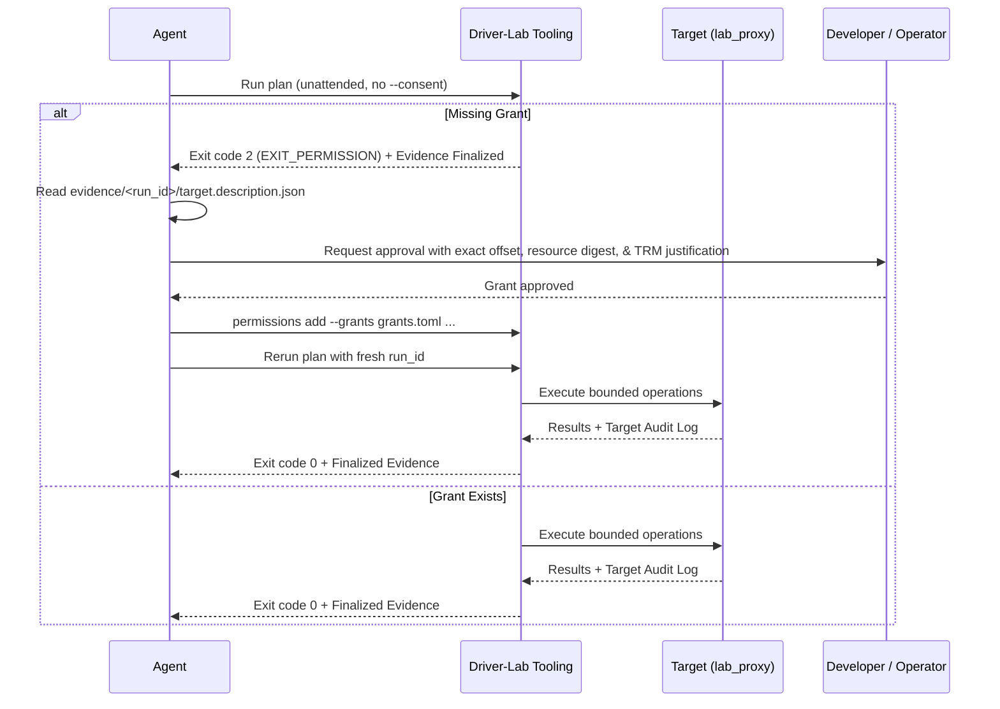

# Driver Lab Skill

This skill teaches agents and developers how to interact with Fuchsia target
hardware safely and empirically using the **driver-lab** proxy driver
(`lab_proxy`) and its host tooling.

The goal is to allow any agent, skill, or workflow to inspect, probe, configure,
and test hardware peripherals (MMIO registers, GPIO pins, I2C/SPI buses, and
interrupts) without bypassing Fuchsia's security, capability, or auditing
boundaries.

---

## 1. Core Concepts & Architecture

Driver-lab provides a dual-mode access model to Fuchsia hardware:

```text
Host Tooling (CLI / Python API)
        │
        ├── Direct Mode ─────────► Published Protocol on Active Driver
        │                          (fuchsia.hardware.gpio, i2c, spi, etc.)
        │
        └── Proxy Mode ──────────► lab_proxy.cm (on Unclaimed Dev Node)
                                   ├── Target Policy & Ceiling Enforcement
                                   ├── MMIO Read/Write/Poll/Snapshot
                                   ├── GPIO / I2C / SPI / Interrupt Endpoints
                                   └── In-Kernel Dispatcher Audit Ring
```

### 1.1 Access Modes

| Mode | Target Driver | Appropriate Use Cases | Guarantees |
| :--- | :--- | :--- | :--- |
| **Proxy Mode** (`proxy`) | `lab_proxy.cm` bound to an unclaimed node | Private MMIO registers, target-local polling sequences, low-level bus exploration, interrupt observation, pre-driver hardware bringup | Target-enforced ceiling policy, fail-closed allowlists, bounded operations, in-driver audit ring |
| **Direct Mode** (`direct`) | Normal driver actively bound | Black-box driver testing, high-level device control via published FIDL protocols, standard GPIO/I2C/SPI protocols | Standard FIDL capability routing, no private MMIO, no target audit ring |
| **Auto Mode** (`auto`) | Dynamic selection | Selecting direct mode if requested capabilities are satisfied without private resources; never downgrades safety | Fails closed if proxy-only guarantees (e.g. MMIO, target audit) are required |

### 1.2 Core Safety Invariants

1.  **Engineering-Only:** `lab_proxy` and driver-lab test packages are strictly
    for engineering (`eng` and `userdebug`) builds. They **must never** be
    present in production (`user`) builds.
2.  **Fail-Closed Permissions:** Register reads require operator consent. In
    unattended agent runs without `--consent`, unknown reads fail closed with
    exit category `2` while finalizing evidence.
3.  **Ceiling Invariance:** Host grants can narrow the target-side policy
    ceiling, but can **never** widen it. Hard target denials are absolute.
4.  **Evidence Before Interpretation:** Never treat an empirical probe as
    verified without citing artifacts from a finalized, tamper-proof hashed
    evidence bundle (`manifest.json` written last).
5.  **Independent Recovery:** Serial logging and board power/reset recovery run
    independently of the in-band FIDL experiment channel. A target crash or
    panic is captured out-of-band.

---

## 2. Prerequisites & Environment Setup

### 2.1 Build Configuration

Ensure driver-lab packages are in your build universe:

```bash
fx set core.x64 \
  --with //src/devices/driver-lab:pkg \
  --with //src/devices/driver-lab/testing:pkg \
  --with //tools/driver-lab:host
fx build
```

### 2.2 Host Tool Location

The host CLI binary is built as a self-contained Python zipapp (`pyz`):

```bash
# Path relative to Fuchsia repository root:
$(fx get-build-dir)/host_x64/obj/tools/driver-lab/driver-lab.pyz

# Helper alias for execution:
DRIVER_LAB="python3 $(fx get-build-dir)/host_x64/obj/tools/driver-lab/driver-lab.pyz"
```

> **Note:** Always run host commands with your working directory set to `$(fx get-build-dir)` or ensure the build directory is in your library paths so bundled native `fuchsia-controller` libraries resolve.

### 2.3 Conformance Setup on Emulator

To test or develop against a simulated hardware device on an emulator:

```bash
# 1. Register test root and proxy drivers ephemerally:
ffx driver register fuchsia-pkg://fuchsia.com/lab_root#meta/lab_root.cm
ffx driver register fuchsia-pkg://fuchsia.com/lab_proxy#meta/lab_proxy.cm

# 2. Add a test node matching lab_root bind rules:
ffx driver test-node add lab-station fuchsia.driver.lab.LAB_ROOT=selected

# 3. Verify topology:
ffx driver dump
# Expected hierarchy: [lab-station] -> [proxy-target] bound to lab_proxy.cm
```

---

## 3. Node & Hardware Discovery

Before executing probe plans, query the target to locate hardware nodes and
verify whether they are unclaimed.

### 3.1 Listing Hardware Nodes

```bash
# List all nodes discovered on the target:
$DRIVER_LAB list --target <target_addr_or_name>

# Filter exclusively for unclaimed nodes eligible for lab_proxy binding:
$DRIVER_LAB list --unclaimed --target <target_addr_or_name>
```

### 3.2 Inspecting Node Details

Query a specific node to view its offered resources (MMIO, GPIO, I2C, SPI,
Interrupts), logical sizes, and per-resource digests:

```bash
$DRIVER_LAB describe --node "dev.lab-station.proxy-target" --target <target_addr>
```

Sample output:
```json
{
  "node_id": "dev.lab-station.proxy-target",
  "bound_driver": "fuchsia-pkg://fuchsia.com/lab_proxy#meta/lab_proxy.cm",
  "boot_id": "a5e7890f-...",
  "proxy_generation": 1,
  "resource_digest": "sha256:1a2b3c...",
  "resources": [
    {
      "id": 1,
      "name": "mmio0",
      "kind": "MMIO",
      "logical_size": 4096,
      "digest": "sha256:4d5e6f..."
    },
    {
      "id": 2,
      "name": "irq0",
      "kind": "INTERRUPT",
      "logical_size": 0,
      "digest": "sha256:7a8b9c..."
    }
  ]
}
```

### 3.3 Binding and Unbinding the Proxy Driver

For unclaimed development nodes:

```bash
# Bind lab_proxy to an unclaimed node:
$DRIVER_LAB bind-proxy --node "dev.lab-station.proxy-target"

# End proxy access and restore the node to unclaimed state:
$DRIVER_LAB end-proxy --node "dev.lab-station.proxy-target"
```

---

## 4. Operator Read Grants & Consent

Driver-lab enforces fine-grained authorization. Register reads that have not
been explicitly authorized will be blocked.

### 4.1 Grant Storage (`grants.toml`)

Grants are persisted in a human-readable TOML store:

```toml
schema_version = 1

[[read_grants]]
grant_id = "grant-mmio0-status"
target_scope = "example-board"
node_id = "proxy-target"
resource_digest = "sha256:4d5e6f..."
resource = "mmio0"
offset = 0x10
width = 4
access = "read_once"
decision = "allow"
approved_at = "2026-09-08T18:00:00Z"
reason = "Datasheet section 3.2: Status register read-only"
```

### 4.2 Managing Grants via CLI

```bash
# 1. List existing grants:
$DRIVER_LAB permissions list --grants grants.toml

# 2. Add an exact read grant:
$DRIVER_LAB permissions add \
  --grants grants.toml \
  --target-scope "example-board" \
  --node-id "proxy-target" \
  --resource-digest "sha256:4d5e6f..." \
  --resource "mmio0" \
  --offset 0x10 \
  --width 4 \
  --access read_once \
  --decision allow

# 3. Check if a plan's accesses are satisfied by grants:
$DRIVER_LAB permissions explain --grants grants.toml --plan plan.json

# 4. Revoke a grant:
$DRIVER_LAB permissions revoke --grants grants.toml --grant-id "grant-mmio0-status"
```

### 4.3 The Unattended Agent Fail-Closed Loop

When an AI agent runs autonomously without an interactive terminal:



---

## 5. Authoring & Executing Probe Plans

Probe plans are pure JSON data structures (`schema_version: 1`). They never
execute arbitrary shell or Python code.

### 5.1 Plan Structure & Supported Operations

```json
{
  "schema_version": 1,
  "run_id": "run-20260908-read-status",
  "case_id": "probe-initial-hardware-state",
  "target": {
    "selector": "default",
    "expected_boot_id": "optional-boot-id-string"
  },
  "node": {
    "id": "proxy-target",
    "expected_unclaimed": true,
    "expected_resource_digest": "sha256:1a2b3c..."
  },
  "access": {
    "mode": "proxy",
    "activation": "bind-unclaimed",
    "requires_target_policy": true,
    "requires_target_audit": true,
    "requires_target_local_timing": false
  },
  "operations": [
    {
      "kind": "mmio_read32",
      "resource": "mmio0",
      "offset": "0x10"
    },
    {
      "kind": "mmio_write32",
      "resource": "mmio0",
      "offset": "0x14",
      "value": "0x00000001",
      "write_mask": "0xffffffff",
      "readback": true,
      "precondition": {
        "expected": "0x00000000",
        "mask": "0x00000001"
      }
    },
    {
      "kind": "mmio_poll32",
      "resource": "mmio0",
      "offset": "0x18",
      "expected": "0x00000001",
      "mask": "0x00000001",
      "interval_ns": 1000000,
      "timeout_ns": 1000000000
    },
    {
      "kind": "mmio_snapshot32",
      "items": [
        {"resource": "mmio0", "offset": "0x00"},
        {"resource": "mmio0", "offset": "0x04"},
        {"resource": "mmio0", "offset": "0x08"}
      ]
    },
    {
      "kind": "sequence",
      "items": [
        {"kind": "mmio_write32", "resource": "mmio0", "offset": "0x20", "value": "0x1"},
        {"kind": "delay_ns", "duration_ns": 500000},
        {"kind": "barrier", "variant": "MEMORY"},
        {"kind": "mmio_read32", "resource": "mmio0", "offset": "0x24"}
      ]
    },
    {
      "kind": "gpio_read",
      "resource": "gpio0"
    },
    {
      "kind": "gpio_write",
      "resource": "gpio0",
      "value": true
    },
    {
      "kind": "i2c_transfer",
      "resource": "i2c0",
      "write_data": [1, 2, 3],
      "read_length": 2
    },
    {
      "kind": "spi_transmit",
      "resource": "spi0",
      "tx_data": [170, 187, 204]
    },
    {
      "kind": "wait_for_interrupt",
      "resource": "irq0",
      "after_sequence": 0,
      "timeout_ns": 2000000000
    }
  ]
}
```

### 5.2 Plan Validation and Digest

Before execution, always validate and digest your plan:

```bash
# Validate schema, keys, and bounds:
$DRIVER_LAB plan validate --plan plan.json

# Calculate canonical cryptographic digest:
$DRIVER_LAB plan digest --plan plan.json
```

### 5.3 Executing a Plan

```bash
$DRIVER_LAB run \
  --plan plan.json \
  --evidence-dir evidence/ \
  --grants grants.toml \
  --target-scope "example-board" \
  --node-id "proxy-target" \
  --moniker "bootstrap/full-drivers:dev.lab-station.proxy-target" \
  --target <target_addr>
```

### 5.4 Exit Codes Reference

| Exit Code | Meaning | Action Needed |
| :--- | :--- | :--- |
| **0** | `EXIT_SUCCESS` | Execution succeeded; interpret evidence. |
| **2** | `EXIT_PERMISSION` / argument error | Missing grant in unattended run, or malformed plan. Add grant to `grants.toml` and rerun with new `run_id`. |
| **3** | `EXIT_STALE` | Stale expectation (boot ID or resource digest mismatch). Refresh node description. |
| **4** | `EXIT_OPERATION` | Operation rejected by target policy, precondition failed, or timeout. Check `target-audit.jsonl`. |
| **5** | `EXIT_TRANSPORT` | Channel closed or transport error communicating with target. |
| **6** | Liveness / Reboot | Target rebooted unexpectedly during execution. Check `serial.log`. |
| **7** | `EXIT_EVIDENCE` | Failed to write or finalize hashed evidence bundle. |
| **8** | `EXIT_ACTIVATION` | Failed to bind or activate proxy driver on target node. |
| **10** | `EXIT_UNSUPPORTED` | Plan requested capability unavailable in current mode (e.g. MMIO in direct mode). |

---

## 6. Using the Public Python API

For automated testing, custom scripts, and interactive tools, use the typed
asynchronous `driver_lab` API.

### 6.1 Basic Hardware Session

```python
import asyncio
from pathlib import Path
from driver_lab import (
    DriverLab,
    SessionMode,
    AccessRequirements,
)

async def main():
    # Connect to target
    lab = await DriverLab.connect(
        target="192.168.1.50:8022",
        node_id="proxy-target",
        grants_path=Path("grants.toml"),
        evidence_root=Path("evidence"),
        target_scope="example-board",
    )

    # Attach to hardware node via proxy session
    async with await lab.attach(
        "proxy-target",
        mode="proxy",
        session_mode=SessionMode.MUTATING,
        requirements=AccessRequirements(needs_mmio=True),
    ) as session:
        # Verify active capabilities
        caps = session.capabilities
        assert caps.target_policy and caps.target_audit

        # MMIO operations
        mmio = await session.mmio("mmio0")
        
        # 1. Read 32-bit register
        val = await mmio.read32(0x10)
        print(f"Register 0x10 = {val:#010x}")

        # 2. Write 32-bit register with precondition and readback verification
        write_res = await mmio.write32(
            offset=0x14,
            value=0x1,
            mask=0x1,
            expected_before=0x0,
            require_readback=True,
        )
        print(f"Write completed, readback = {write_res.readback_value:#010x}")

        # 3. Target-local polling (polls in driver dispatcher without host round trips)
        poll_res = await mmio.poll32(
            offset=0x18,
            expected=0x1,
            mask=0x1,
            interval_s=0.001,
            timeout_s=1.0,
        )
        print(f"Polled register 0x18 matched: {poll_res.value:#010x}")

        # 4. GPIO / I2C / SPI / Interrupts
        gpio = await session.gpio("gpio0")
        state = await gpio.read()
        await gpio.write(not state)

        i2c = await session.i2c("i2c0")
        data = await i2c.transfer(write_data=b"\x00\x01", read_length=4)

        spi = await session.spi("spi0")
        rx = await spi.transmit(tx_data=b"\xAA\xBB")

        irq = await session.interrupt("irq0")
        irq_outcome = await irq.wait(timeout_s=5.0)
        print(f"Observed interrupt sequence {irq_outcome.sequence} at ts {irq_outcome.timestamp_ns}")

if __name__ == "__main__":
    asyncio.run(main())
```

### 6.2 Running Plans via Python API

```python
result = await lab.run_plan(plan_dict)
if not result.ok:
    print(f"Plan failed with exit category {result.exit_category}: {result.failure}")
else:
    for read in result.reads:
        print(f"Read {read.resource}:{read.offset:#x} = {read.value:#x}")

# Automated interpretation report
report = result.interpret()
print(f"Audit verification: {report['status']}")
```

---

## 7. Evidence Analysis & Ground-Truth Verification

Every run produces an isolated evidence bundle directory under
`evidence/<run_id>/`:

```text
evidence/<run_id>/
├── manifest.json                  <-- Hashes of all artifacts (written last!)
├── plan.requested.json            <-- Original submitted plan
├── plan.canonical.json            <-- Normalized, canonical plan
├── plan.digest                    <-- SHA-256 digest of canonical plan
├── target.description.json        <-- Target identity, boot ID, generation, resources
├── permission-resolution.json     <-- Audit trail of grant checks and decisions
├── operations.jsonl               <-- Host operations log
├── target-audit.jsonl             <-- Target proxy driver audit ring log
├── serial.log                     <-- Out-of-band target serial console output
└── interpretation.json            <-- Derived analysis and panic detection
```

### 7.1 Inspecting `target-audit.jsonl`

The target audit ring records what actually executed in hardware:

```json
{"seq": 1, "session": 1, "resource": 1, "operation": "read32", "offset": 16, "decision": "ALLOWED", "status": "OK", "value": 4277009102, "timestamp_ns": 1234567890}
{"seq": 2, "session": 1, "resource": 1, "operation": "write32", "offset": 20, "decision": "ALLOWED", "status": "OK", "value": 1, "timestamp_ns": 1234568100}
```

* If an access was denied by policy: `"decision": "DENIED"`, `"denial":
  "NOT_PERMITTED_BY_CEILING"` or `"NOT_IN_ALLOWLIST"`.
* If hardware faulted: `"status": "BACKEND_FAULT"`.

### 7.2 Verification Protocol for AI Agents

1.  **Check Manifest Integrity:** Ensure `manifest.json` matches all file
    hashes.
2.  **Never Extrapolate Unread Registers:** Only claim a register holds a value
    if it appears in `target-audit.jsonl` with `status: "OK"`.
3.  **Check Timestamps:** Correlate host start/end times with `timestamp_ns` to
    verify monotonicity and target latency.
4.  **Inspect Serial:** Check `serial.log` for kernel panics, OOPS messages, or
    driver crashes.

---

## 8. Translating Empirical Findings into Driver Code

When you have empirically validated register offsets and sequences, translate
them into DFv2 C++ or Rust drivers:

### 8.1 C++ (`fdf::MmioBuffer` / `hwreg`)

| Driver-Lab Python | Fuchsia DFv2 C++ Analogue |
| :--- | :--- |
| `val = await mmio.read32(0x10)` | `uint32_t val = mmio.Read32(0x10);` |
| `await mmio.write32(0x14, 0x1)` | `mmio.Write32(0x1, 0x14);` |
| `await mmio.write32(0x14, 0x1, mask=0x1)` | `mmio.ModifyBits32(0x1, 0x1, 0x14);` |
| `await mmio.poll32(0x18, expected=1, mask=1)` | `hwreg::RegisterAddr<StatusReg>(0x18).ReadFrom(&mmio).Poll(...)` |
| `await gpio.read()` | `gpio_client->Read()` |
| `await gpio.write(true)` | `gpio_client->Write(true)` |
| `await i2c.transfer(data, len)` | `i2c_client->Transfer(...)` |
| `await irq.wait()` | `irq.wait(&timestamp)` |

### 8.2 Rust (`fuchsia_async` / `zx::Interrupt`)

| Driver-Lab Python | Fuchsia DFv2 Rust Analogue |
| :--- | :--- |
| `val = await mmio.read32(0x10)` | `let val = mmio.read32(0x10);` |
| `await mmio.write32(0x14, 0x1)` | `mmio.write32(0x14, 0x1);` |
| `await mmio.poll32(...)` | Loop with `fuchsia_async::Timer` |
| `await gpio.read()` | `gpio.read().await` |
| `await gpio.write(true)` | `gpio.write(true).await` |
| `await irq.wait()` | `fuchsia_async::OnSignals::new(&irq, zx::Signals::INTERRUPT).await` |

---

## 9. Summary Checklist for Workflows

- [ ] Node is verified as unclaimed before attempting proxy activation (`list
  --unclaimed`).
- [ ] Plan declares exact 4-byte aligned offsets within `logical_size`.
- [ ] Required read grants are persisted in `grants.toml` with valid resource
  digests.
- [ ] Mutating plans specify preconditions and readback expectations.
- [ ] Plan validation and digest checks pass (`plan validate` & `plan digest`).
- [ ] Evidence directory is freshly created; manifest hashes are verified upon
  completion.
- [ ] Empirical claims cite `target-audit.jsonl` records and raw values.
