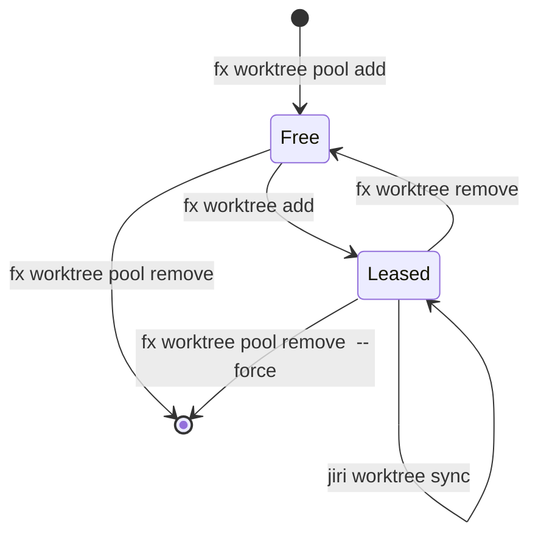

# fx worktree

`fx worktree` manages a pool of reusable, multi-repository Fuchsia checkouts for
parallel development.


## Overview

Fuchsia developers and automated coding agents frequently work on multiple tasks
at the same time. Running parallel builds or switching branches inside a single
Fuchsia checkout invalidates incremental **GN** (Generate Ninja) and Ninja build
caches inside `out/`. Creating and deleting full checkouts from scratch for each
task also wastes disk I/O and discards compiled build artifacts when the task
finishes.

`fx worktree` solves this problem by combining `jiri worktree` multi-repository
checkouts with a persistent, lease-based worktree pool. Instead of destroying a
checkout after a task completes, `fx worktree` detaches the task alias and
restores baseline GN build arguments. The tool then returns the physical
checkout and its populated `out/` build directories to the pool for immediate
reuse.

## Quick Start

You can create, build inside, inspect, and release a leased worktree in five
commands. Follow these steps to complete a full task lifecycle:

1. Create and lease a worktree for your task (auto-provisioning a new pool slot
   if none are free):

   ```bash
   fx worktree add my-feature
   ```

2. Navigate to the leased worktree directory using `fx worktree locate`:

   ```bash
   cd "$(fx worktree locate my-feature)"
   ```

3. Configure a build directory (if the pool slot does not already have one) and
   run a build:

   ```bash
   fx set fuchsia.arm64
   fx build
   ```

4. List all currently leased worktrees, their sync status, and their build
   directories:

   ```bash
   fx worktree list
   ```

5. Release the worktree back to the pool when your task is complete:

   ```bash
   fx worktree remove my-feature
   ```

## Usage and Workflows

### Everyday Task Lifecycle

Top-level `fx worktree` subcommands mirror standard `git worktree` ergonomics
while operating on pooled checkouts under the hood. When you run
`fx worktree add <name>`, the tool claims an available free checkout from
`.jiri_root/worktrees/` and backs up existing `args.gn` files. The command then
runs `jiri worktree sync` and creates a relative symlink at
`.jiri_root/worktrees/<name>`:

```bash
# Claim a free slot (or auto-provision a new slot) as 'bugfix-123'
fx worktree add bugfix-123

# Optionally claim a specific free physical slot from the pool by name
fx worktree add bugfix-123 --pool-name warm-lagoon

# Print the resolved physical path to the worktree
fx worktree locate bugfix-123

# Inspect active leased worktrees, git sync counts, and build directories
fx worktree list

# Release 'bugfix-123' back to the pool while preserving its out/ directory
fx worktree remove bugfix-123
```

Updating the main Fuchsia checkout with `jiri update` leaves existing worktrees
on their previous manifest revision. Run `jiri worktree sync` to re-synchronize
an active worktree with the main checkout's manifest:

```bash
# Run from inside the leased worktree directory
jiri worktree sync

# Or specify the worktree path explicitly from any directory
jiri worktree sync "$(fx worktree locate bugfix-123)"
```

### Pool Administration

You rarely need to manage the worktree pool manually because `fx worktree add`
automatically provisions a new physical checkout whenever the pool has no free
slots. Manual pool administration via `fx worktree pool` helps when you want to
pre-warm slots with `fx set` configurations or share the main checkout's
`local/` directory. You can also use `fx worktree pool remove` to reclaim disk
space by permanently deleting unused physical checkouts:

```bash
# Provision a randomly named slot (e.g., 'warm-lagoon') with two build dirs
fx worktree pool add \
  --set "fuchsia.arm64 --auto-dir" \
  --set "fuchsia.x64 --auto-dir" \
  --symlink-local

# List all physical slots in the pool (both free and leased)
fx worktree pool list

# Permanently delete a free physical worktree and its out/ dirs from disk
fx worktree pool remove warm-lagoon

# Force removal of a physical worktree even when an active task holds a lease
fx worktree pool remove warm-lagoon --force
```

### Machine-Readable JSON Output

Automated workflows and AI coding agents can pass `--json` to `add`, `list`, and
`pool list` to receive structured output on standard output. Passing `--json` to
`fx worktree add <name>` emits a JSON object containing the task identifier and
symlink path:

```json
{
  "worktree_id": "agent-refactor",
  "path": "/home/user/fuchsia/.jiri_root/worktrees/agent-refactor"
}
```

Passing `--json` to `fx worktree list` or `fx worktree pool list` emits a JSON
array of worktree status objects. In `list --json`, `name` holds the active task
alias; in `pool list --json`, `name` always holds the physical slot name and
`task` is `null` when the slot is free:

```json
[
  {
    "name": "warm-lagoon",
    "task": "agent-refactor",
    "sync": {
      "behind": 0,
      "new": 2
    },
    "build_dirs": [
      {
        "path": "out/fuchsia.arm64",
        "active": true,
        "config": "fuchsia.arm64",
        "last_build": "5m ago"
      }
    ]
  }
]
```

### Shell Tab Completion

`fx worktree` integrates with Bash (`//scripts/fx-env.sh`) and Zsh
(`//scripts/zsh-completion/_fx_worktree`) tab completion through the internal
`fx worktree _complete <filter>` subcommand. The completion scripts filter
candidate worktree names based on the active subcommand context:

- `fx worktree remove <TAB>` completes only active leased task aliases.
- `fx worktree pool remove <TAB>` completes only registered physical slot names.
- `fx worktree add --pool-name <TAB>` completes only free physical slot names.
- `fx worktree locate <TAB>` completes both active task aliases and physical
  slot names.

## Architecture

### Relationship with jiri worktree

`fx worktree` acts as a higher-level lifecycle and build-directory manager on
top of `jiri worktree`. The two tools divide responsibilities across distinct
layers:

- **`jiri worktree` (Lower-Level Multi-Repo Checkout Layer)**: Manages the
  physical creation, synchronization, and deletion of git worktrees across all
  repositories in the Fuchsia Jiri manifest. Specifically,
  `jiri worktree add <path>` provisions git worktrees, links **CIPD** (Chrome
  Infrastructure Package Deployment) prebuilts, and registers `<path>` in
  `.jiri_root/worktrees_registry`. Meanwhile, `jiri worktree sync [<path>]`
  aligns repositories with the parent manifest, and
  `jiri worktree remove [-force] <path>` deletes and unregisters the checkout.
- **`fx worktree` (Higher-Level Pooling, Leasing, and Build Layer)**: Wraps
  `jiri worktree` to prevent destructive teardown of build caches. `fx worktree`
  introduces a pool of reusable physical slots (`WorktreePool`), atomic lease
  tracking (`lease.json`), task aliasing via relative symlinks, and automatic
  backup and restoration of GN build arguments (`BuildDir`).

### Physical Worktree Pool and Task Aliasing

`WorktreePool` (`worktree_pool.py`) resolves the primary Fuchsia checkout root
(`FUCHSIA_DIR`) and reads `.jiri_root/worktrees_registry` to discover all
provisioned physical worktrees. When you invoke `fx worktree` from inside a
worktree, `WorktreePool` automatically traverses upward out of
`.jiri_root/worktrees/<slot>` to locate the main checkout. When provisioning a
new slot without an explicit name, `WorktreePool` generates a random
`<adjective>-<noun>` identifier (such as `warm-lagoon` or `amber-badger`).

A `Worktree` instance (`worktree.py`) represents each physical checkout rooted
at `.jiri_root/worktrees/<slot-name>`. `Worktree` manages two filesystem
artifacts to coordinate task leases:

- **Atomic Lease File (`<worktree>/.jiri_root/lease.json`)**: Determines whether
  a physical slot is in the `FREE` or `LEASED` state. `Worktree.acquire_lease()`
  opens `.jiri_root/lease.json` with `os.O_CREAT | os.O_EXCL` to prevent race
  conditions when multiple processes claim worktrees concurrently. The file
  stores a JSON object containing `worktree_id` (the physical slot name), `pid`,
  `timestamp_sec`, `path`, and `task_id` (the user-facing task name).
- **Task Alias Symlink (`.jiri_root/worktrees/<task-name>`)**: Claiming a slot
  with `fx worktree add <task-name>` creates a relative symlink
  `.jiri_root/worktrees/<task-name>` pointing to `<slot-name>`. Running
  `fx worktree remove <task-name>` unlinks the symlink and deletes `lease.json`.

IMPORTANT: `fx worktree add` intentionally keeps the worktree on a detached git
`HEAD` (synchronized to the parent checkout's `JIRI_HEAD` via
`jiri worktree sync`) rather than checking out a named git branch. Avoiding
unnecessary branch switches preserves the modification timestamp on
`.git/worktrees/<slot>/HEAD`, which prevents Ninja from invalidating build
stamps across pooled builds. When `fx worktree remove` releases a slot,
`release_lease()` runs `git checkout --detach` so the slot returns to a detached
`HEAD` even if the developer manually switched branches during the task.

`fx worktree` stores pool metadata, task symlinks, lease locks, and build
backups under `.jiri_root/`. The following directory tree shows how
`fx worktree` organizes physical slots and task symlinks on disk:

```text
<fuchsia_root>/
└── .jiri_root/
    ├── worktrees_registry         # Paths of registered physical slots
    └── worktrees/
        ├── my-feature -> warm-lagoon
        └── warm-lagoon/           # Physical worktree slot directory
            ├── .fx-build-dir      # Active build dir (out/fuchsia.arm64)
            ├── .jiri_root/
            │   └── lease.json     # Active lease metadata (task_id, pid)
            └── out/
                ├── default -> fuchsia.arm64
                └── fuchsia.arm64/
                    ├── args.gn    # Active GN build arguments
                    ├── args.gn.ref
                    ├── build.ninja
                    ├── .ninja_log # Used for last-build elapsed time
                    └── last_ninja_build_success.stamp
```

### Build Directory and GN Arguments Lifecycle

Each physical worktree retains its `out/` build directories across leases so
subsequent tasks can perform incremental builds. `Worktree.build_dirs()` and
`BuildDir` (`build_dir.py`) manage the discovery, status inspection, and
configuration lifecycle of `out/` directories inside each pooled checkout:

- **Build Directory Discovery**: `Worktree.build_dirs()` reads `.fx-build-dir`
  (falling back to `out/default` if `.fx-build-dir` does not exist) and scans
  all immediate subdirectories of `out/` that contain `args.gn` or
  `build.ninja`. `Worktree.build_dirs()` resolves symlinks and filters out any
  directory literally named `default` so that `out/default` symlinks do not
  appear as duplicate entries alongside the real build directory.
- **GN Arguments Backup and Restore**: When a task acquires a lease on a
  worktree, `BuildDir.backup_args()` copies `args.gn` to `args.gn.ref` in every
  discovered build directory. If a developer or agent modifies GN arguments
  during the task, `BuildDir.restore_args()` copies `args.gn.ref` back over
  `args.gn` and removes `args.gn.ref` when `fx worktree remove` releases the
  lease. Restoring the backup guarantees that the next task claiming the slot
  inherits a clean baseline build configuration.
- **Configuration and Build Health Inspection**: `BuildDir.get_build_config()`
  parses `args.gn` for `build_info_product` / `build_info_board` assignments or
  `//products/<name>.gni` / `//boards/<name>.gni` imports (including
  `//vendor/...` paths) to format `<product>.<board>`.
  `BuildDir.get_build_status()` inspects `args.gn`, `.ninja_errors.json`, and
  `last_ninja_build_success.stamp` to classify the directory as
  `Not Configured`, `Configured`, `Built`, `Dirty`, or `Build Failed`. Finally,
  `BuildDir.get_build_time_ago_sec()` reads the modification time of
  `.ninja_log` to calculate how long ago the last build ran.

### Lifecycle State Transitions

A physical worktree slot transitions between `FREE` and `LEASED` states across
multiple tasks before eventual removal from the pool. The following diagram
illustrates the state transitions of a physical worktree slot from creation to
deletion:



Each CLI operation transitions a physical slot between states. The following
table summarizes the state transitions for each command:

| Operation                        | State Transition            |
| :------------------------------- | :-------------------------- |
| `fx worktree pool add [<slot>]`  | Unprovisioned → `FREE`      |
| `fx worktree add <task>`         | `FREE` → `LEASED`           |
| `fx worktree remove <task>`      | `LEASED` → `FREE`           |
| `fx worktree pool remove <slot>` | `FREE` / `LEASED` → Deleted |

During each transition, `fx worktree` mutates specific metadata files and
symlinks inside `.jiri_root/`. The following list details the mechanical
operations performed at each stage:

- **Provisioning (`fx worktree pool add [<slot>]`)**: Invokes
  `jiri worktree add .jiri_root/worktrees/<slot>`, appends the path to
  `.jiri_root/worktrees_registry`, optionally links or copies `local/`, and
  optionally runs `fx set`.
- **Claiming (`fx worktree add <task>`)**: Selects a free slot (or runs
  `pool add` if none exist), atomically writes `.jiri_root/lease.json`, copies
  `args.gn` → `args.gn.ref` across `out/*`, runs `jiri worktree sync`, and
  creates the relative symlink `.jiri_root/worktrees/<task>` → `<slot>`.
- **Releasing (`fx worktree remove <task>`)**: Restores `args.gn.ref` →
  `args.gn` across `out/*`, runs `git checkout --detach`, removes
  `.jiri_root/lease.json`, and unlinks `.jiri_root/worktrees/<task>`.
- **Deleting (`fx worktree pool remove <slot>`)**: Verifies no active lease
  exists (unless you pass `--force`), invokes `jiri worktree remove`, deletes
  `.jiri_root/worktrees/<slot>`, and removes the path from
  `.jiri_root/worktrees_registry`.

## Testing

You can run the unit test suite either directly with Python's `unittest` runner
or through the Fuchsia build system. Run the following commands to execute the
tests:

```bash
# Fast local execution without a full build
python3 -m unittest discover -s tools/devshell/worktree/tests -p "test_*.py"

# Host test execution via fx test
fx test //tools/devshell/worktree:tests
```
